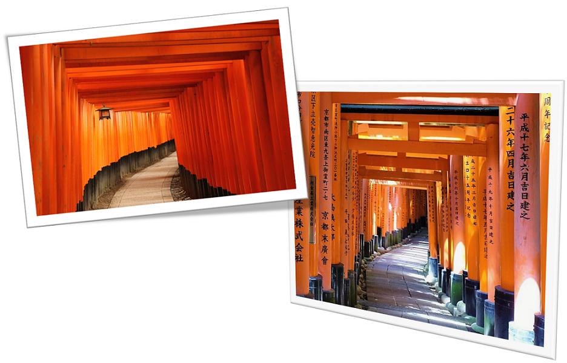

<figure style="width: 650px" class="align-center">
  
  <figcaption></figcaption>
</figure>

##  History 
**Fushimi Inari-taisha** (伏見稲荷大社) - the head shrine of Inari - is one of the oldest shrines located in Fushimi-ku, Kyoto, Japan.  The god worshiped at the Fushimi Inari-taisha Shrine is the famous Inari-Daimyojin, who responds to the prayers of a prosperous business and bountiful harvest. In addition, Inari-Daimyojin also blesses the peaceful family, traffic safety, sublimation in art.

##  Symbol 
It is home to the famed tunnel of thousands of  <b> red torii gates </b>  (Senbon Torii), which was appeared as the setting for the movie Memoirs of a Geisha. The torii gates along the entire trail are donations by individuals and companies that you will find their name and the date of the donation carved on the back of each gate. This shrine is definitely one of the most popular sightseeing destinations in Japan.

<figure style="width: 650px" class="align-center">
  
  <figcaption></figcaption>
</figure>

##  The Foxes 
In ancient Japan, some myths said that foxes are capable of using magic. That’s why **foxes (kitsune) are regarded as the messengers** so many fox statues often found around the shrine. There are many Inari rice cake shops decorated with foxes. There are also a few restaurants, which serve locally themed dishes such as Inari sushi and **Kitsune Udon** (Fox Udon).

<figure style="width: 600px" class="align-center">
  
  <figcaption></figcaption>
</figure>

Before leaving, you can take a walk to the small food street next to the shrine, which has various types of street food like okonomiyaki, takoyaki, and fresh orange juice.

<figure style="width: 650px" class="align-center">
  
  <figcaption></figcaption>
</figure>

<table>
  <tr>
	<th style="text-align:center; font-size:25px;color:red; font-weight:bold" colspan="2"> Fushimi Inari-taisha </th>
     </tr>
	
  <tr>
	<td> <b> Rating </b> </td>
    <td> :star: :star: :star: :star: :star: </td>
      </tr>
	
  <tr>
	<td> <b> Address </b> </td>
    <td> 68 Fukakusa Yabunouchi-cho, Fushimi-ku, Kyoto City 612-0882 </td>
    </tr>
	
  <tr>
	<td> <b> Tel/Fax </b> </td>
    <td> (075) 641-7331  /   (075) 642-2153 </td>
   </tr>
	
  <tr>
	<td> <b> Website </b> </td>
    <td> <a href="http://inari.jp/en/" target="_blank"> http://inari.jp/en/ </a> </td>
   </tr>
	
  <tr>
	<td> <b> Fee </b> </td>
    <td>Free </td>
   </tr>
	 
	 </table>

##  How to get there 

If you use the **JR Line**, stop at Inari Station - the second station from Kyoto Station along the JR Nara Line (~5 minutes). The shrine can also be reached in a short walk from Fushimi Inari Station along the Keihan Main Line.

If you go by **city bus**, it will stop at Inari-taisha-mae station, from here walk take 7 minutes. In the temple compound, there is a 170-seat parking lot, dedicated to visitors to the temple.

This shrine is worth to go if you are planning a trip to Japan. The sceneries are fabulous and so "Japanese" that are usually showed on TV. Sure you will get many fantastic photo shoots here. Look at the orange-red color of torii gates, so unique and classic. :blue_heart: Check for detail <a href="https://www.youtube.com/watch?v=4ofKe0mqjDI" target="_blank">here</a>, and <a href="http://aquabubu.com/blog/travel/Nara-Deer-Park-in-Japan/" target="_blank">here</a> for the review of Nara deer park.
