Japanese cuisine usually emphasizes the fresh and pure taste of their food. The taste of Japanese dishes is often mild, delicious and suitable for their natural season. Due to the location surrounded by the sea, seafood and seaweed occupy a large part of the Japanese food. In addition, processed foods from soybeans are also a special point in Japanese cuisine. 

As for the drink, the Japanese are famous for their tea blends, especially the pure green tea powder made by the Zen master - the main tea for tea ceremonies. High-grade sakamai rice alcohol called sake, derived from the rituals of the Shinto is also very popular. Besides, Japanese dishes also reflect the sophisticated aesthetic thought and craftsmanship of the cook when decorating the dishes, so that guests can see the beauty of the food container as well.

Below is the list of some tasty and special dishes in Japan that one can’t miss when being there.

##  Rice (Gohan - ご飯) 

Rice is the main food of the Japanese that can be used for wrapping in dry seaweed sheet or forming sushi, which is considered as Japanese specialties.

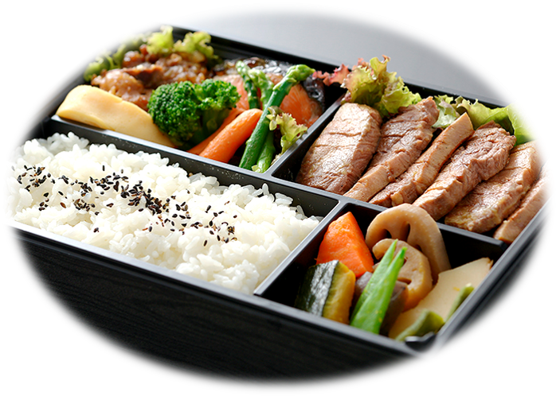 **Bento (弁当)** – when going out, the Japanese often make a box of rice (bento) including foods from the forest and the sea that consist of rice (or onigiri), fish (or meat), vegetables and dessert.

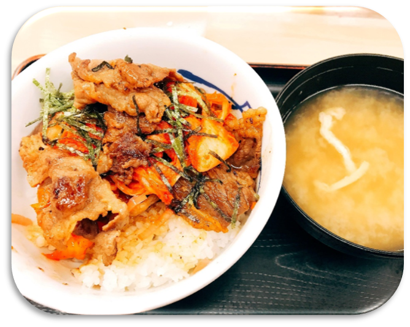 **Donburi (ドンブリ)** - consisting of fish, meat, vegetables or other ingredients simmered together and served over rice. It’s served with a miso soup.

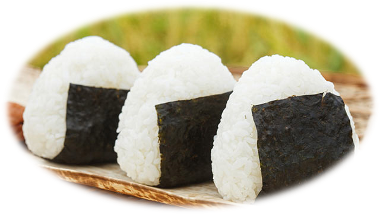 **Onigiri (おにぎり)** – made from white rice formed into triangular or cylindrical shapes and often wrapped in nori (seaweed).

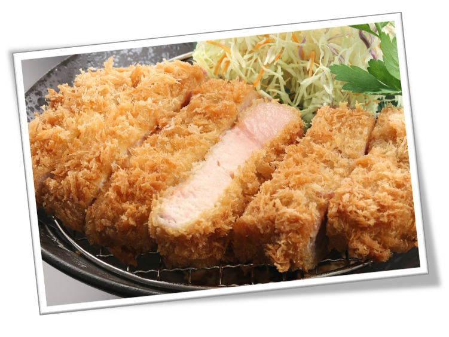 **Tonkatsu (トンカツ)** – consists of a breaded, deep-fried pork cutlet. There are two main types, fillet and loin. It is often served with shredded cabbage.

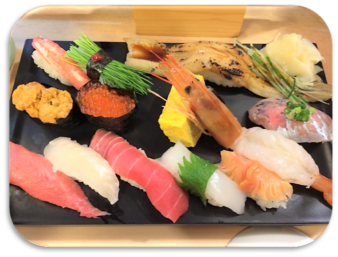 **Sushi (すし)** – this famous traditional dish is made with specially prepared rice that’s mixed with vinegar, salt, and sugar and served with raw or cooked seafood on top.

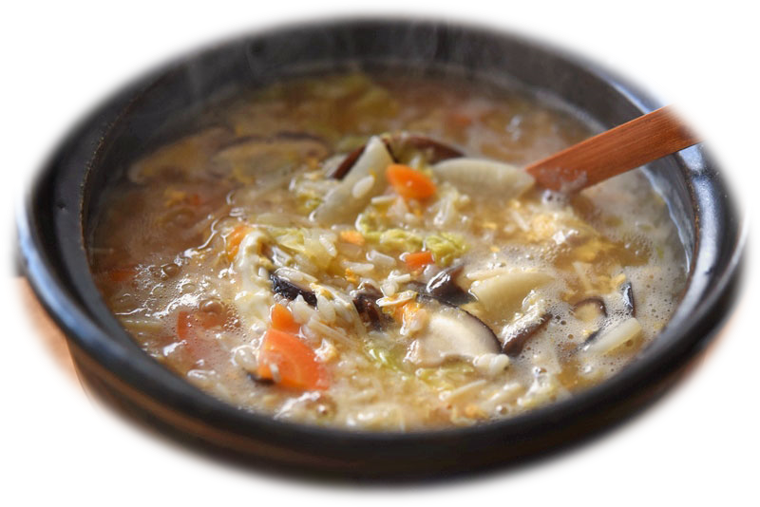 **Kayu (お粥)** - rice porridge made by slow cooking rice in lots of water. Kayu is often garnished with umeboshi and is commonly served to sick people because it is easily digestible.

##  Noodles (麺) 

Noodles are one of the main parts of Japanese cuisine. They are often served chilled with dipping sauces, or in soups or hot dishes.

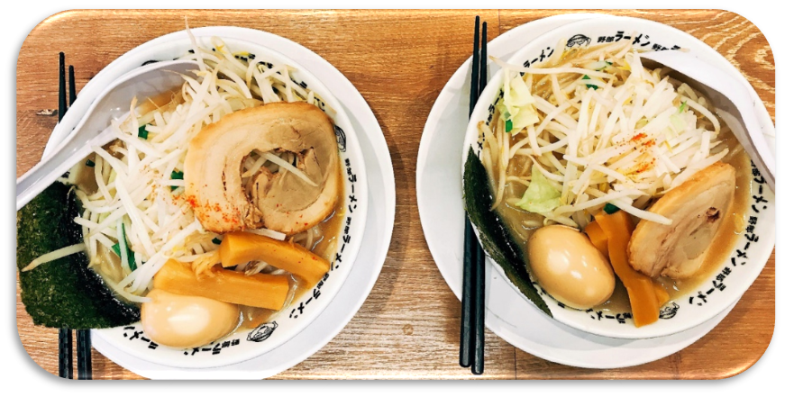 **Ramen (ラーメン)** - thin, wheat-based noodles made from wheat flour, salt, water, and kansui (a form of alkaline water). Ramen has a firm texture and pale yellow in color. They are served in a broth.

 **Soba (そば)** - made from buckwheat and wheat flour. The noodles are available dried or fresh and may be served with hot broth or cold with dipping sauce.

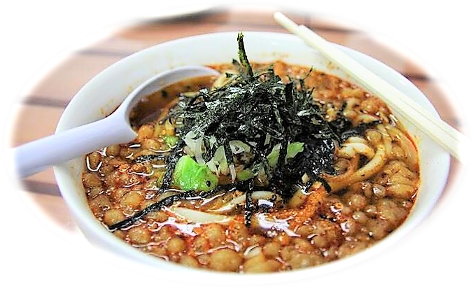 **Udon (うどん)** - the thickest noodles in Japanese Cuisine. Udon is white, wheat-based noodles, that are 4-6mm in width. These dishes are served chilled with a dipping sauce in the summer months, or in hot dishes and soups when the temperature gets colder.
  
	
##  Tempura (天ぷら) 

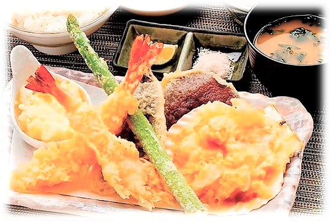 Tempura is a classical Portuguese dish brought to and popularized by Japan, consisting of seafood, meet or vegetables coated with batter and deep fried. The resulting food has a light, but crispy texture, that may be seasoned with salt or dipped in a light sauce before eating. 

##  Unagi dishes (うなぎ料理) 

This is the Japanese eel dishes. Unagi contains rich nutrients including vitamins necessary to face the debilitating heat of summer. Moreover, it is easy to digest, and good for stomachs and intestines.

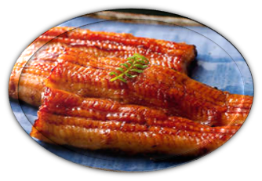 **Kabayaki (蒲焼)** - grilled eel (without head or tail) prepared by splitting and boning, skewering, then grilling while basting a sweet unagi sauce made from soy sauce, mirin (sweetened sake), sake and sugar.

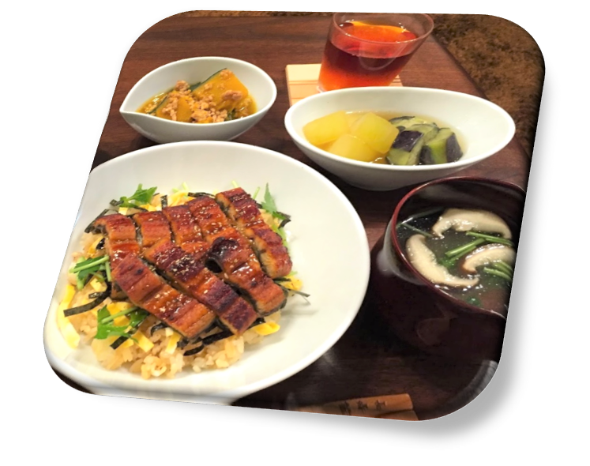 **Hitsumabushi (ひつまぶし)** - this is shredded grilled eel over rice. Hitsumabushi is usually served with condiments such as wasabi, chopped nori (seaweed) and spring onions, and dashi broth or tea.

##  Nabe Dishes (鍋料理) 

This is the hot pot dishes in Japan, usually served in a hot pot containing vegetables such as negi (Japanese leek) and hakusai (Chinese cabbage), various mushrooms, seafood and/or meat.

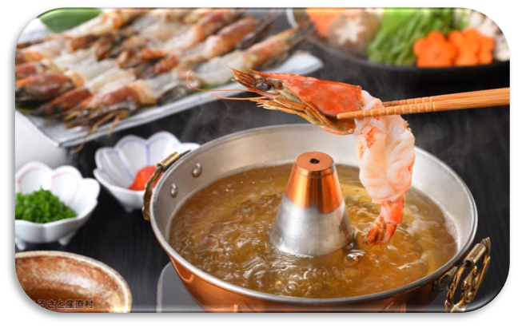 **Shabu Shabu (しゃぶしゃぶ)** - a very popular hot pot where pieces of thinly sliced meat, seafood, vegetables, mushrooms, and tofu, are cooked by dipping them into a hot soup. The bite-sized pieces are then dipped into a ponzu citrus or sesame sauce before being eaten.

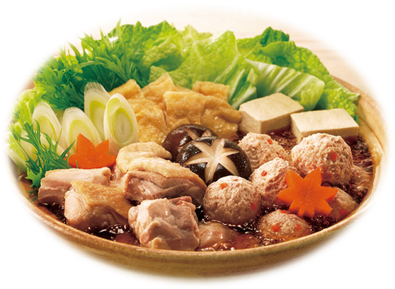 **Chanko Nabe (ちゃんこ鍋)** - this is the traditional staple diet of sumo wrestlers. There are many varieties of chanko nabe, which can be tried at the several specialty chanko nabe restaurants around Ryogoku, the sumo district in Tokyo.

##  Sashimi (刺身)  

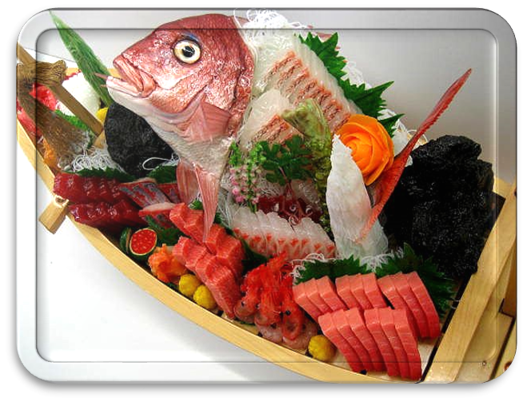 A diverse of fish can be enjoyed raw if they are fresh and prepared correctly. They're usually served with soy sauce and wasabi.

In this post, I just introduce some savory main foods in Japan. However, the Japanese still have a lot of unique and delicious street foods that you can't miss. What are these street foods? Let's take a look <a href="http://aquabubu.com/en/Japanese-cuisine-Part-2/" target="_blank">here</a>.

