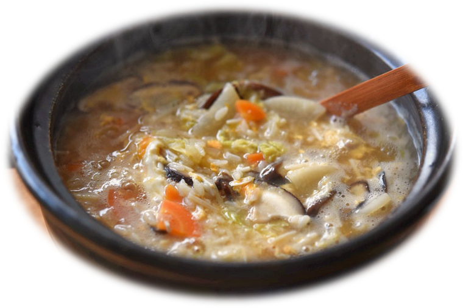
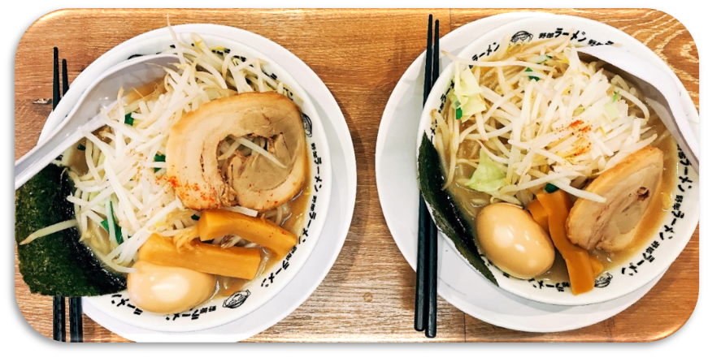
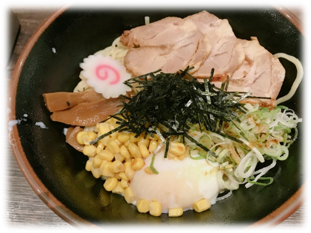
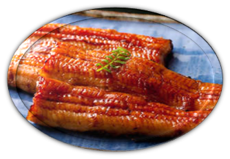
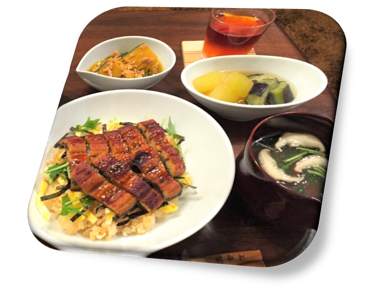
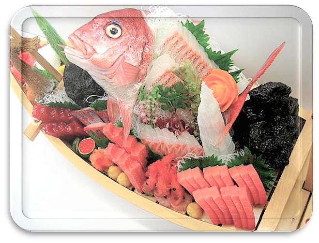

Ẩm thực Nhật Bản thường chú trọng vào hương vị tươi mới và tinh khiết của các món ăn. Hương vị của các món ăn Nhật Bản thường thanh nhẹ và thích hợp cho sự thay đổi theo mùa ở nước họ. Do vị trí bao quanh bởi biển, các loại hải sản và rong biển chiếm một phần quan trọng trong các bữa ăn của người Nhật. Ngoài ra, thực phẩm chế biến từ đậu nành cũng là một điểm đặc trưng trong ẩm thực nước này.

Đối với đồ uống, người Nhật nổi tiếng với nghệ thuật pha trà (trà đạo), đặc biệt là bột trà xanh tinh khiết được làm bởi các thiền sư - là loại trà chính trong các buổi tiệc trà. Rượu gạo sakamai nồng đọ cao được gọi là sake. Bên cạnh đó, các món ăn của Nhật Bản cũng phản ánh được gu thẩm mỹ tinh xảo và sự khéo léo của người nấu trong việc trang trí các món ăn, để khách hàng có thể nhìn thấy không chỉ vẻ đẹp của  món ăn mà còn đẹp ở vật đựng món ăn đó (nghệ thuật sắp đặt đấy mn ạ:laughing:).

Dưới đây là danh sách một số món ngon và đặc trưng ở Nhật Bản mà nếu có điều kiện, bạn không nên bỏ lỡ khi đến đó.

##  Món cơm (Gohan - ご飯) 

Cơm là món ăn chính của người Nhật và có thể được sử dụng để cuộn trong rong biển khô hoặc làm món sushi hay nhiều món khác. Các món cơm khá đa dạng và cũng là một nét đặc trưng riêng của đất nước mặt trời mọc này.

 **Bento (弁当)** – khi đi ra ngoài, người Nhật thường làm một hộp cơm (bento) có những thực phẩm từ rừng và biển bao gồm cơm (hoặc onigiri-cơm nắm), cá (hoặc thịt), rau và món tráng miệng.
 **Donburi (ドンブリ)** - tô cơm với thức ăn (cá, thịt, rau...ddax nấu chín) để trên mặt cơm. Nó được ăn kèm với súp miso.

 **Onigiri (おにぎり)** – cơm nắm được làm từ gạo trắng rồi nắn thành hình khối tam giác hoặc hình trụ và thường được bọc trong nori (rong biển).

 **Tonkatsu (トンカツ)** – cơm với thịt heo cắt miếng chiên xù thật giòn, thường được ăn kèm với bắp cải xào.

 **Sushi (すし)** – món ăn truyền thống nổi tiếng này được làm bằng cách trộn một ít giấm, đường vô cơm rồi và hải sản sống hoặc chín đặt lên trên.

 **Kayu (お粥)** - món cháo nấu từ gạo ở Nhật, thường được nấu cho người bệnh ăn vì giúp tiêu hoá dễ dàng.

##  Món mì (麺) 

Mì cũng là một trong những món ăn chính của ẩm thực Nhật Bản. Có những món mì ăn lạnh với nước chấm, hoặc ăn nóng với nước dùng.

 **Ramen (ラーメン)** - sợi mỳ mỏng làm từ bột mì, muối, nước, và kansui (một dạng nước kiềm). Ramen có màu vàng nhạt, thường được ăn với nước dùng.

 **Soba (そば)** - làm từ kiều mạch và bột mì. Có loại mì khô hoặc tươi và có thể ăn với nước dùng nóng hoặc ăn lạnh với nước chấm.

 **Udon (うどん)** - đây là loại mì dày nhất trong trong các món mì ở Nhật. Udon có màu trắng, làm từ lúa mì, sợ mì có chiều rộng 4-6mm. Món này ăn lạnh với nước chấm trong những tháng mùa hè, hoặc ăn nóng với nước dùng khi trời lạnh.
  
	
##  Các món chiên bột (天ぷら) 

 Tempura là một món ăn từ Bồ Đào Nha du nhập sang Nhật Bản. Tất cả hải sản, thịt hoặc rau đều có thể phủ được bột và chiên giòn. Món này thường được ăn kèm trong các món ăn chính như cơm hoặc mì, chấm tương khi ăn. 

##  Các món lươn (うなぎ料理) 

Đây là các món lươn của Nhật Bản. Unagi có chứa chất dinh dưỡng phong phú bao gồm vitamin cần thiết để chống lại cơn nóng bức của mùa hè. Hơn nữa, nó còn dễ tiêu hóa, tốt cho dạ dày và ruột.

 **Kabayaki (蒲焼)** - lươn nướng (bỏ đầu hoặc đuôi) được làm sạch và sơ chế trước, sau đó nướng trong sốt unagi ngọt được làm từ nước tương, mirin (sake ngọt), sake và đường.

 **Hitsumabushi (ひつまぶし)** - đây là lươn nướng nướng trên cơm. Hitsumabushi thường được ăn với wasabi, nori (rong biển), hành lá, và nước dashi hay trà.

##  Các món lẩu (鍋料理) 

Đây là món lẩu của Nhật Bản, trong một nồi lẩu có chứa rau như negi (rau thơm Nhật) và hakusai (cải thảo), nấm, hải sản và/hoặc thịt.

 **Shabu Shabu (しゃぶしゃぶ)** - một món lẩu rất phổ biến vơi những miếng thịt, hải sản, rau, nấm, đậu hũ mỏng được nhúng vào nồi nước nóng (khá giống bò nhúng giấm ở Việt Nam). Đồ ăn có kích thước nhỏ vừa, sau khi nhúng thì chấm nước sốt rồi ăn.

 **Chanko Nabe (ちゃんこ鍋)** - món lẩu này có trong chế độ ăn uống truyền thống của các đô vật sumo. Có nhiều loại lẩu chanko mà bạn có thể ăn thử tại các nhà hàng chanko nabe đặc sản trên khắp Ryogoku, một khu quận tập trung các đô vật sumo ở Tokyo.

##  Sashimi (刺身)  

 Ở Nhật, nhiều loại cá có thể ăn sống nếu chúng tươi và được chế biến đúng cách. Chúng thường được ăn với nước tương và wasabi. Món này vá sushi là nổi tiếng quá rồi nhỉ, hai cái đều là đồ sống. Điểm khác duy nhất là sushi là món cơm với đồ sống, sashimi chỉ là đồ sống thôi.

Trong bài viết này, mình chỉ giới thiệu về các món ăn chính thôi. Ở Nhật còn vô số các món ăn vặt độc đáo nhưng không kém phần ngon miệng đâu nhé. Các bạn xem thêm bài món ăn vặt ở <a href="http://aquabubu.com/vi/Japanese-cuisine-Part-2/" target="_blank">đây</a> nhe.^^