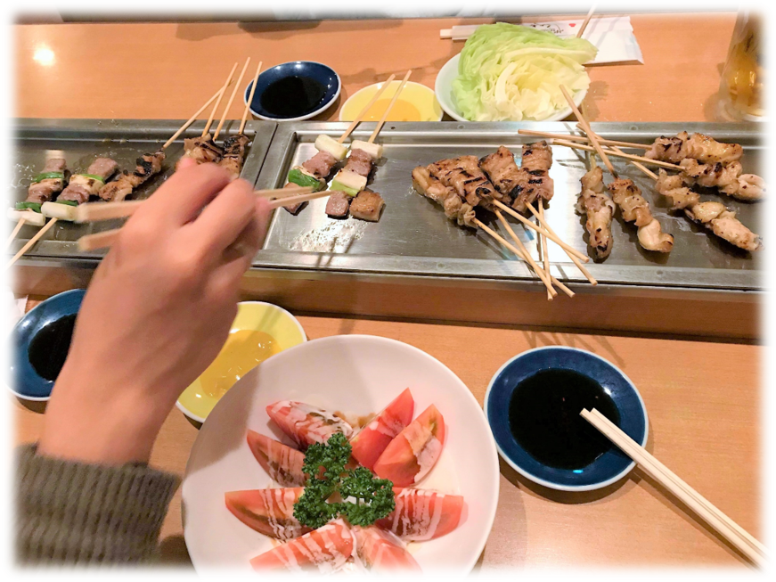
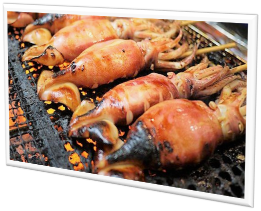
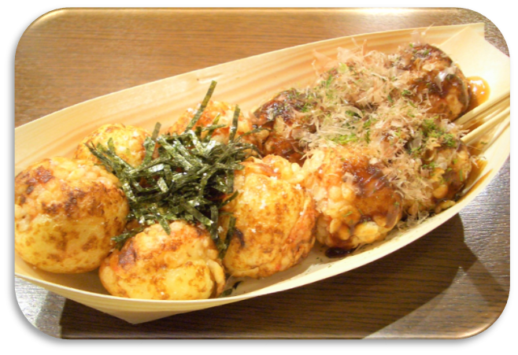
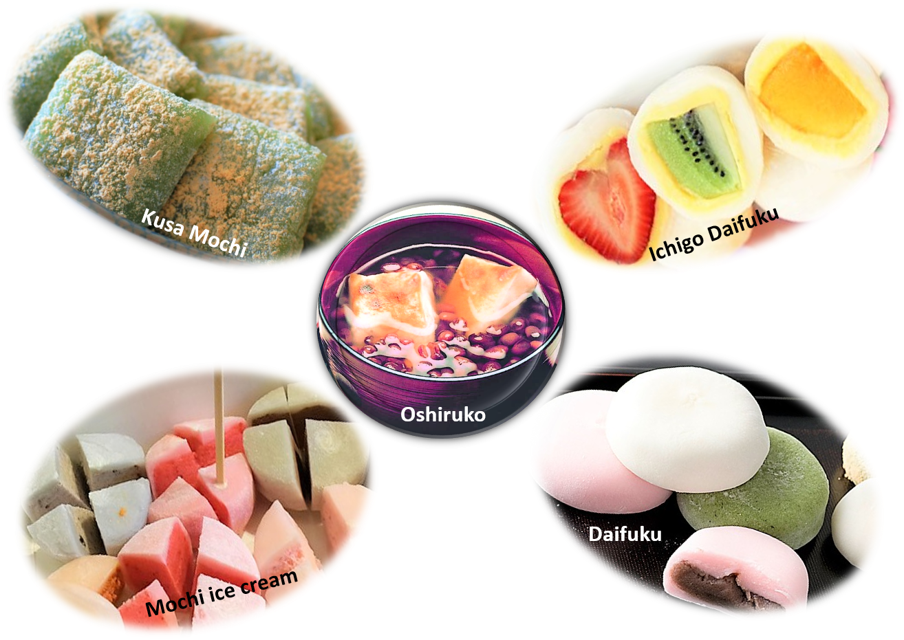
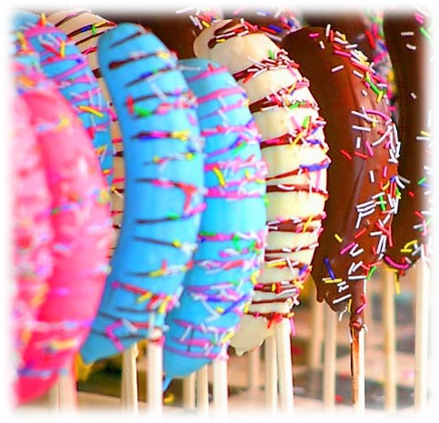
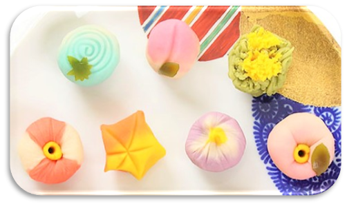

In the <a href="http://aquabubu.com/en/Japanese-cuisine-Part-1/" target="_blank">previous post</a>, I have introduced the main food in Japan. Now, let's continue with their unique street food.^^

### Okonomiyaki (お好み焼き)

<figure style="width: 600px" class="align-center">
  
  <figcaption></figcaption>
</figure>

Okonomiyaki is a savory pancake filled with any number of things (but usually cabbage and pork), mixed into a batter and grilled. It is topped with fish flakes, dried seaweed, mayonnaise and a Worcester-style sauce. So delicious! This one is one of my favorites in my Japan trip. 

### Yakitori (焼鳥)

<figure style="width: 600px" class="align-center">
  
  <figcaption></figcaption>
</figure>

This is the charcoal grilled chicken. Nearly every part of the chicken is on the menu, all grilled to perfection, seasoned with either shio (salt) or tare (a sweet soy sauce-based sauce) and served with a side of friendly banter. Taste good, but nothing’s special. However, you should try if this is your first time here.

### Nikuman (ニクマン)

 Nikuman is the Japanese name for Chinese Baozi dumplings filled with pork. It tastes goods but I prefer the taste of dumplings in Vietnam.

### Ikayaki (イカ焼き)

<figure style="width: 600px" class="align-center">
  
  <figcaption></figcaption>
</figure>

Grilled squid. The portion of squid served may be the whole body (except the entrails), rings cut from the body, or one or more tentacles, depending on the size. A good street food you should try.

### Takoyaki (たこ焼き)

 Takoyaki is a kind of dumpling, made from grilled puffs of seasoned batter with a small piece of octopus meat in the middle, with sauces and seasonings scattered along the top. This savory dish is very famous and even appears in other Asia countries.

### Senbei (せんべい)

 Senbei is a traditional Japanese snack made from rice. It tastes good, and there are many kinds of Senbei in Japan. This is also a favorite food of the deer in <a href="http://aquabubu.com/en/Japan-travel-Nara-Deer-Park/" target="_blank">Nara park</a>.

### Oden (おでん)

<figure style="width: 600px" class="align-center">
  
  <figcaption></figcaption>
</figure>

A hot pot dish prepared with various fish cakes, daikon, boiled eggs, konyaku and kombu seaweed, slowly simmered in a soy sauce-based soup. 

###  Dorayaki (どら焼き)

<figure style="width: 600px" class="align-center">
  
  <figcaption></figcaption>
</figure>

Doraemon is my most favorite Japanese manga, and he loves this dorayaki. Therefore, nothing can stop me from trying this cute cake - а red bean pancake which consists of two small pancake-like patties made from castella wrapped around a filling of sweet Azuki red bean paste.

### Mochi (餅)

Japanese rice cake made of mochigome, a short-grain japonica glutinous rice. There are so many kinds of them. If you like sweety things, mochi is definitely a right choose for you.

<figure style="width: 600px" class="align-center">
  
  <figcaption></figcaption>
</figure>

  * **Daifuku (大福)** - This is a soft round mochi stuffed with sweet filling, such as sweetened red bean paste or white bean paste

  * **Ichigo Daifuku (いちご大福)** - A version of daifuku containing a whole strawberry inside (strawberry can be replaced with other fruits).

  * **Kusa Mochi (草餅)** - A green variety of mochi flavored with yomogi (mugwort).

  * **Mochi ice cream (もちアイス)** - Small colorful balls made from Japanese mochi (pounded sticky rice) with an ice cream filling.

  * **Oshiruko (おしるこ)** - A sweet dessert soup made with red beans and pieces of mochi.

### Chocolate Banana (チョコバナナ)

 This colorful street food dessert will make you surprise with its taste and form. The banana is coated with chocolate (milk, dark or white), and is often dunked in colorful sugar strands.

### Namagashi (生菓子)

<figure style="width: 600px" class="align-center">
  
  <figcaption></figcaption>
</figure>

Namagashi is a category of traditional Japanese dessert that includes any fresh prepared sweet that is fancy enough to present at the tea ceremony.

