Trong <a href="http://aquabubu.com/vi/Japanese-cuisine-Part-1/" target="_blank">bài viết trước</a>, mình đã giới thiệu các món ăn chính ở Nhật. Bây giờ mình sẽ giới thiệu các món ăn vặt ngon và độc đáo của họ nhé. ^^

### Okonomiyaki (お好み焼き)

<figure style="width: 600px" class="align-center">
  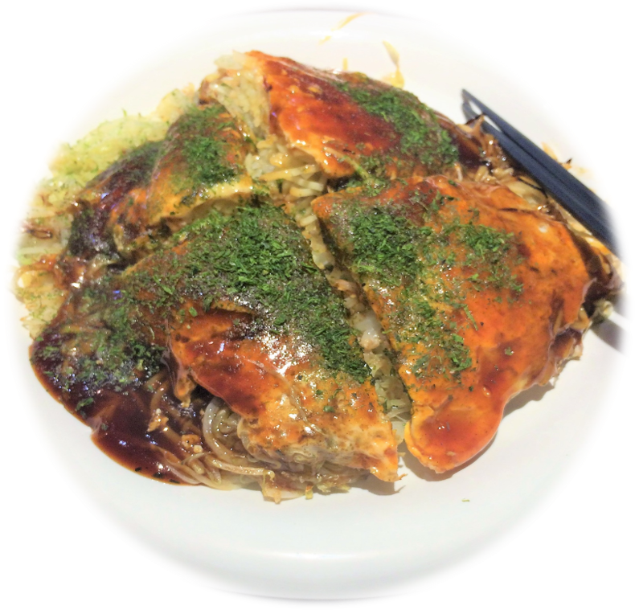
  <figcaption></figcaption>
</figure>

Đây chính là món bánh xèo của ngwơif Nhật đấy. Bánh xèo với nhân chủ yếu là thịt heo và rau bắp cải, được chiên trong chảo dầu nóng. Khi ăn thì xịt tương  Worcester lên. Món này ăn ngon và là một trong những món mình thích nhất ở Nhật.

### Yakitori (焼鳥)

<figure style="width: 600px" class="align-center">
  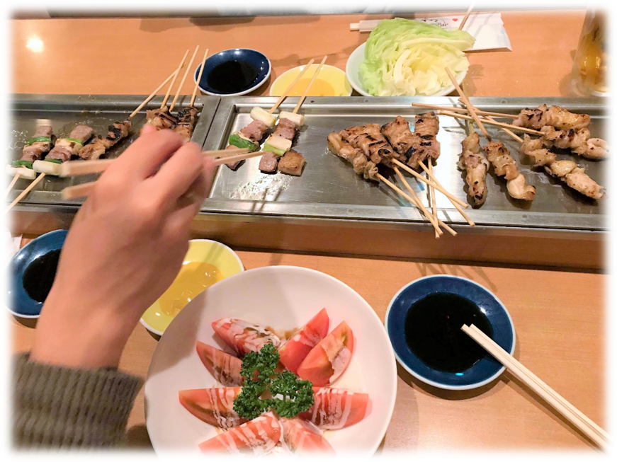
  <figcaption></figcaption>
</figure>

Đây là món gà xiên nướng, món này ăn cũng bình thường thôi. Nhưng kiểu ở Nhật người ta ăn với sốt riêng và hay bán dọc các con đường nên dễ ăn và nhiều người biết đến.

### Nikuman (ニクマン)

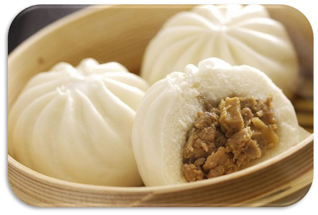 Món này y chang bánh bao thôi. Ăn cũng ngon, nhưng mình vẫn thích bánh bao Việt Nam nhất.:smile:

### Ikayaki (イカ焼き)

<figure style="width: 600px" class="align-center">
  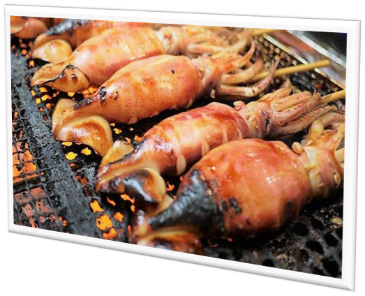
  <figcaption></figcaption>
</figure>

Món này là nguyên con mực (đã bỏ ruột) xiên vô que rồi nướng. Ăn vặt cũng ok lắm.

### Takoyaki (たこ焼き)

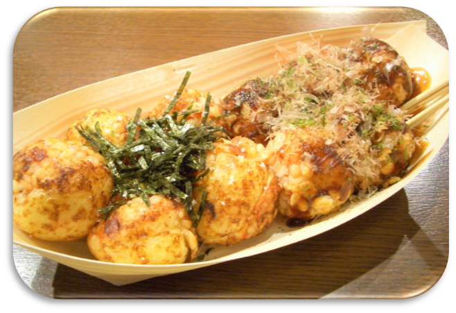 Takoyaki huyền thoại đây mọi người ạ. Bánh bột hình khối tròn, bên trong là 1 miếng bạch tuộc. Ở Nhật cái nhân bạch tuộc bên trong chất lượng hơn ở Việt nhé.:laughing:

### Senbei (せんべい)

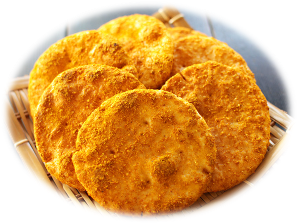 Đây là món bánh gạo, ăn được. Đây là món yêu thích của mấy em hươu nai ở <a href="http://aquabubu.com/vi/Japan-travel-Nara-Deer-Park/" target="_blank">công viên Nara</a> nhé.

### Oden (おでん)

<figure style="width: 600px" class="align-center">
  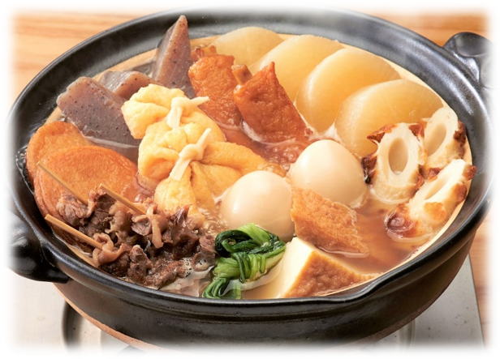
  <figcaption></figcaption>
</figure>

Đây là món lẩu bánh cá. Bánh cá ở Nhật giống giống chả cá bên mình, nhưng ăn nhiều bột hơn nên mình không thích lắm. Ăn thử một lần cho biết cũng được nhé. 

###  Dorayaki (どら焼き)

<figure style="width: 600px" class="align-center">
  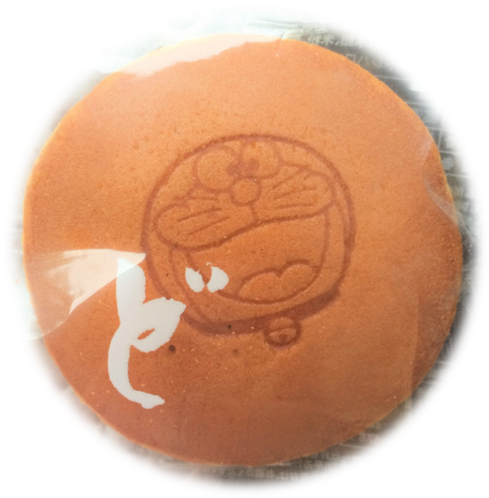
  <figcaption></figcaption>
</figure>

Có ai là fan doraemon giống mình không nhỉ? Bánh rán huyền thoại bạn Mèo ú thích đây. Bột bánh ăn ngon nhưng mình không thích nhân đậu đỏ lắm.

### Mochi (餅)

Mochi là bánh gạo Nhật Bản. Có nhiều loại mochi lắm, hầu hết là các món ngọt. Ai thích đồ ngọt thì không thể bỏ qua đâu nhé.

<figure style="width: 600px" class="align-center">
  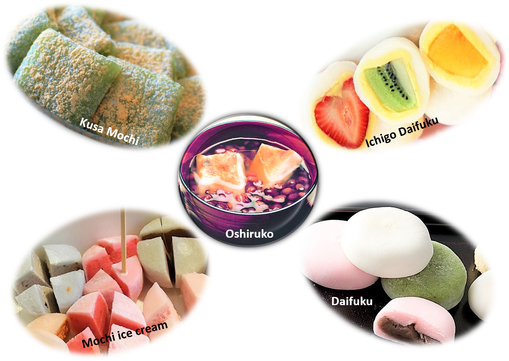
  <figcaption></figcaption>
</figure>

  * **Daifuku (大福)** - Bánh gạo nhân sốt đậu đỏ ngọt.

  * **Ichigo Daifuku (いちご大福)** - Một phiên bản khác của daifuku với nhân trái cây.

  * **Kusa Mochi (草餅)** - Mochi xanh có rắc bột cây ngải cứu lên trên.

  * **Mochi ice cream (もちアイス)** - Mochi nhiều màu sắc với nhân kem bên trong.

  * **Oshiruko (おしるこ)** - Món chè đậu đỏ này có cho vài miếng bánh gạo bên trong.

### Chocolate Banana (チョコバナナ)

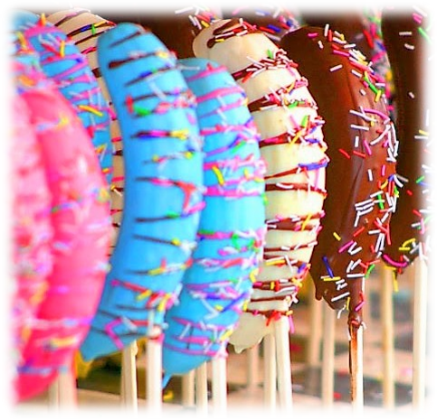 Món này nhìn hay nè các bạn. Quả chuối được phủ socola (socola sữa, đen hoặc trăng), rồi rắc kẹo trang trí hạt nhiều màu sắc lên.

### Namagashi (生菓子)

<figure style="width: 600px" class="align-center">
  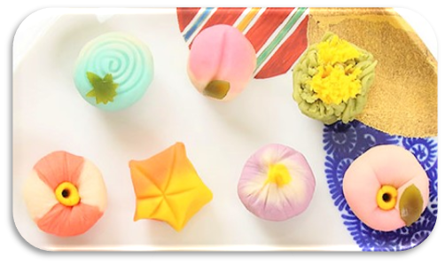
  <figcaption></figcaption>
</figure>

Namagashi là một loại món tráng miệng truyền thống của Nhật Bản với các món đồ ngọt được làm với hình dáng và màu sắc cực bắt mắt. Món này thường được phục vụ trong các buổi tiệc trà.

