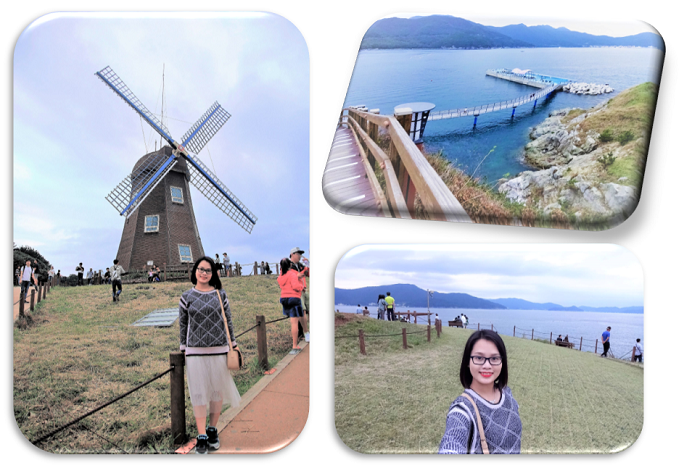
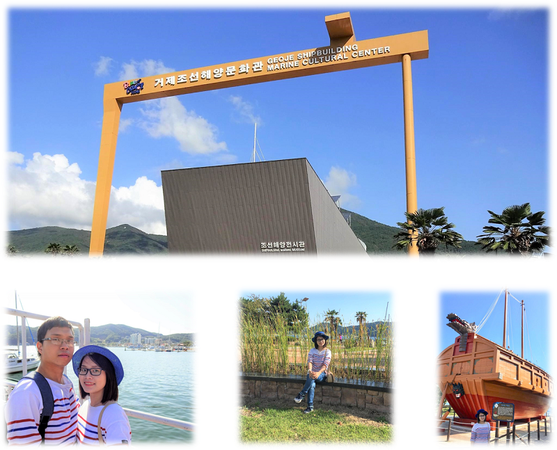
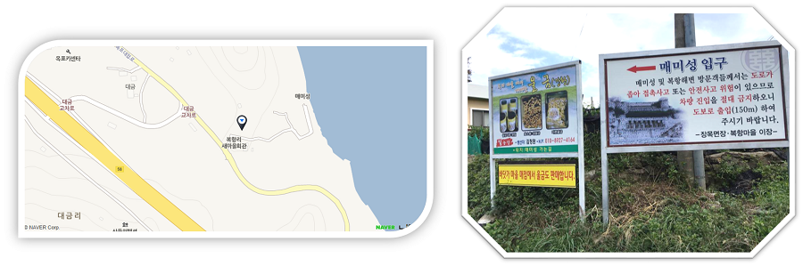
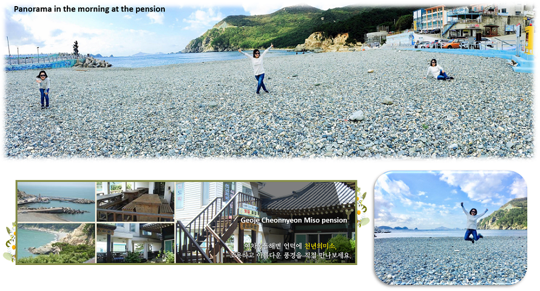

Geojedo hay đảo Geoje là hòn đảo chính của thành phố Geoje, nằm trên bờ biển phía nam của tỉnh Gyeongsang Nam. Đây là đảo lớn thứ hai của Hàn Quốc, chỉ sau đảo Jeju. Đảo Geoje bao gồm nhiều đảo lớn, nhỏ với bờ biển xanh ngắt cùng nhiều điểm đến hấp dẫn trên đảo. Geoje được nối với Busan bằng cây cầu dài 8,2 km và một đường hầm thông dưới biển nên giao thông khá thuận lợi. 

<figure>
  
  <figcaption style="font-size: 17px; align="center">  </figcaption>
</figure>

Trong bài viết này, mình xin giới thiệu chuyến đi chơi ở đảo Geoje và chia sẻ kinh nghiệm của mình với những địa điểm tham quan nổi tiếng và các nhà hàng mình đã ăn ở nơi này.

##  Bãi đá đen Hakdong Mongdol (학동몽돌해변) &  Bãi tắm Gujora (구조라해수욕장)  

Đây là bãi biển nổi tiếng ở Geoje. Bãi biển không có bờ cát trắng mà là một bãi sỏi trải dài. Người Hàn ví bãi sỏi này như là ngọc trai đen nhưng mình thì thấy sỏi ở đây cũng bình thường thôi. Thật ra sỏi ở đây phần lớn màu xanh đen, chỗ nào sóng đánh vô bị ướt thì mới thành “sỏi đen” thôi. Nhưng bãi biển dài và sạch đẹp, nước trong xanh. Gia đình mình ra đây chơi tí à, lượm vài cục sỏi về chơi thôi chứ không dừng lâu ở đây.

<figure>
  
  <figcaption style="font-size: 17px; align="center">  </figcaption>
</figure>

Bãi tắm Gujora thì đẹp, và dài, cát mịn và bãi biển rất sạch sẽ. Chụp hình đẹp. :smile:

##  Đồi gió (Windy Hill - 바람 의 언덕) 

<figure>
  
  <figcaption style="font-size: 17px; align="center">  </figcaption>
</figure>

Đồi gió này cũng là một nơi phải đi khi đến Geoje. Khung cảnh thì đẹp đấy, nhưng mình đi vào lễ Chusoek (tết trung thu, kì lễ lớn nhất ở Hàn) và đi vào giờ thiêng nên chỗ này đông người lắm, nhìn đâu cũng thấy người + trời sắp tối nên hình chả đẹp. Ai đi chỗ này thì nên đi sáng sớm 7-8h. Chỗ này có bãi cỏ trống trên cao nhìn ra biển khá đẹp, rất thích hợp cho việc tự sướng. :laughing:

##  Trung tâm văn hóa hàng hải Geoje (조선해양전시관) 

<figure>
  
  <figcaption style="font-size: 17px; align="center">  </figcaption>
</figure>

Nếu bạn muốn biết về lịch sử và cách đóng tàu của người Hàn, đây có thể là nơi thích hợp để tham quan. Đây là một trung tâm văn hóa điển hình của Hàn Quốc với rất nhiều thông tin. Nó khá thú vị nhưng không có nhiều thứ để xem lắm, đi một xíu là hết cái coi rồi. Nơi này thích hợp cho các gia đình có trẻ em vì ở bên trong có phòng chơi lớn cho trẻ em, khá vui.
Bên ngoài trung tâm, có một mô hình tàu con rùa nổi tiếng của Hàn quốc (거북선), từng xuất hiện trong bộ phim **Tướng Quân Yi Shun Shin**. Bộ phim này dựa trên trận chiến lịch sử ở Myeongnyang, bộ phim khá hay.

<figure>
  
  <figcaption style="font-size: 17px; align="center">  </figcaption>
</figure>

##  Oedo Botania (외도 보타니아) and Haekeumkang (해금강) 

Đây là **khu vườn thực vật Oedo Botania** trên một đảo nhỏ khác. Từ đảo Geoje có thể đi thuyền 20 phút để ra đảo này. Oedo Botania đúng là thiên đường cây xanh với hơn 3.000 loài thực vật, rất đa dạng và nhiều cây lạ lắm. Mình đánh giá đây là nơi phải đi ở Geoje, rất xứng đáng. Hòn đảo này chỉ có một quán cà phê và một cửa hàng lưu niệm nhỏ. Trên đường di chuyển bằng tàu đến vườn Oedo - Botania, bạn sẽ thấy đảo đá tự nhiên Haekumkang. Đây được coi là danh thắng nổi tiếng thứ hai ở Geoje và có giá trị bảo tồn sinh thái. Nói thì nói vậy thôi chứ lúc đi ngang chỗ này thấy đá không à, nhiều người xem nên cũng hơi bất tiện.

<figure>
  
  <figcaption style="font-size: 17px; align="center">  </figcaption>
</figure>

### Đôi nét về Oedo

<figure>
  
  <figcaption style="font-size: 17px; align="center">  </figcaption>
</figure>

Khi các chủ sở hữu Changho Lee và Hosook Choi chuyển đến đó năm 1973, họ đã cố gắng trồng quýt và chăn nuôi heo - nhưng đều thất bại. Năm 1976, họ nghĩ đến việc tạo ra một nơi du lịch đảo vườn. Trong những năm dài từ 1976 đến 1994, hòn đảo này được cải tạo thành vườn thực vật, và được mở cửa tham quan vào năm 1995. Kể từ đó, hòn đảo này đã đón tiếp khoảng 18 triệu du khách và cũng có bổ sung thêm vài thứ mới như ngọn hải đăng và đài quan sát. 

Với những fan hâm mộ phim **Bản tình ca mùa đông**, vườn thực vật Oedo Botania chắc chắn sẽ là một trải nghiệm thú vị bởi đây chính là nơi quay <a href="https://www.youtube.com/watch?v=jvbsv5m354E" target="_blank">tập cuối cùng</a> với cuộc hội ngộ của hai nhân vật Kang Junsang và Jung Yoojin. Biệt thự trắng nằm lưng chừng núi cũng là bối cảnh ngôi nhà của Kang Junsang.

### Tips

  * Trước khi bạn đi đến đảo Oedo Botania, bạn có thể tải ứng dụng Oedo Island, nó có hướng dẫn bằng giọng nói và giải thích bằng tiếng Anh từ lúc bạn lên phà. Hòn đảo có thể rất đông khách vào mùa hè và những ngày lễ lớn ở Hàn.
  * Không có khách sạn trên Oedo đâu nhé vì vậy hãy chắc chắn rằng bạn lên được đúng chuyến phà trở về Geoje. Khi đặt vé phà thì bạn sẽ được phát thẻ, người ta qui định giờ tham quan khoảng gần 1,5 tiếng thôi, bạn phải canh giờ để về và lên đúng chuyến phà của mình. 
  * Để đặt vé phà thì mình đặt đi Oedo và Haekeumkang lúc 2:30 chiều tại <a href="http://www.hggtour.net/main.php" target="_blank">Haekeumkang Ferry Terminal</a> (해금강유람선) vì mình thuê pension gần chỗ này. Nhưng có rất nhiều bến tàu có thể đi Oedo nhé
  * Giờ mở cửa của đảo là từ bình minh đến hoàng hôn. Oedo đóng cửa vào ngày giao thừa và ngày đầu năm mới. Ngày mở cửa cũng theo điều kiện thời tiết nữa, nếu dự báo thời tiết xấu, phà sẽ không chạy.

##  Memisong (매미성) 

<figure>
  
  <figcaption style="font-size: 17px; align="center">  </figcaption>
</figure>

Memisong có kiến trúc giống như một tòa thành ở châu Âu, làm bằng đá và vị trí sát bờ biển làm cho nơi đây trở nên lí tưởng cho những bức ảnh tuyệt vời. Nghe nói là hồi xưa xưa nào đó, có cơn bão lớn nên một gia đình đã lạc đến đảo này, rồi họ xây tòa thành này, không biết có đúng không nữa. 

<figure>
  
  <figcaption style="font-size: 17px; align="center">  </figcaption>
</figure>

Chỗ này tuy đẹp nhưng lại ít có du khách nước ngoài biết đến lắm nhé, chủ yếu là người Hàn biết thôi. Mình nghe nói ở Geoje có khá nhiều địa điểm bí mật. Mình rất thích chỗ này, trong cả chuyến đi Geoje của mình thì mình thích chỗ này nhất đấy, mà xui cái lúc mình đi cũng có khá đông người.:laughing:

##  Nhà nghỉ - Pension 

<figure>
  
  <figcaption style="font-size: 17px; align="center">  </figcaption>
</figure>

Do mình đi ôtô đến Geoje nên có thể chạy dọc đường bờ biển và ghé vô bất cứ chỗ nào mình thích, thời gian cũng khá thoải mái. Mình thuê một pension ở phía Nam đảo Geoje tên là **Geoje Cheonnyeon Miso pension (거제 천년의미소 펜션)**, có bãi biển đá sát pension. Bãi đá ở đây y hệt chỗ bãi đá đen Hakdong Mongdol, nhưng nhỏ và xấu hơn tí, buổi sáng không xem được mặt trời mọc do ở hướng Nam, và ở khá xa khu thành phố Okpo nên tốt không đi đâu được, chỉ loanh quanh bãi biển gần pension thôi. Ai đi du lịch thì nhớ xem vị trí khách sạn cho tiện đường nhé, cứ tìm khách sạn, nhà nghỉ trên agoda hoặc booking là được.
