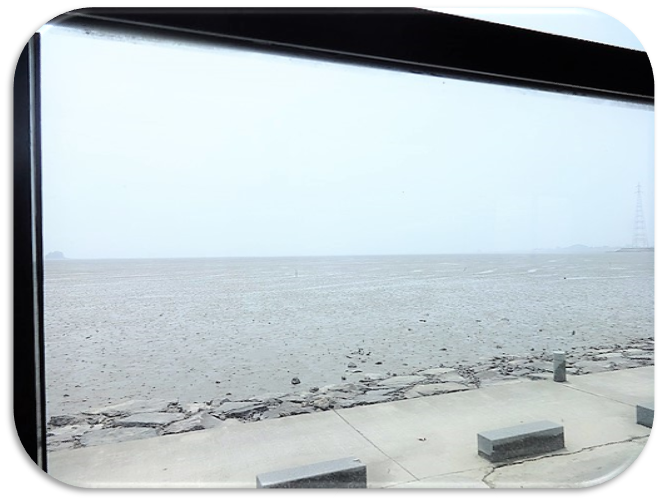
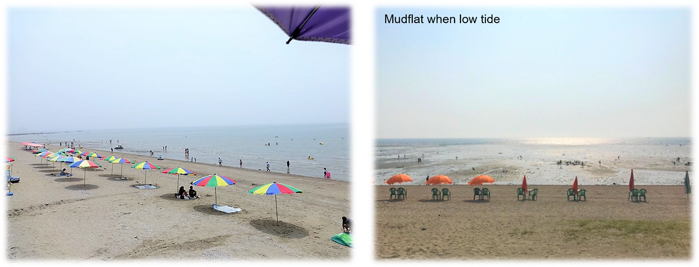
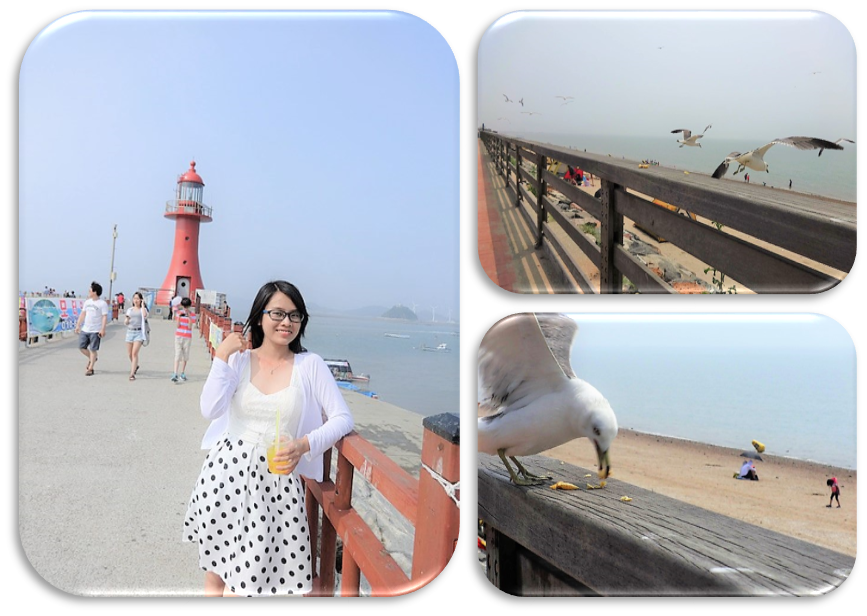
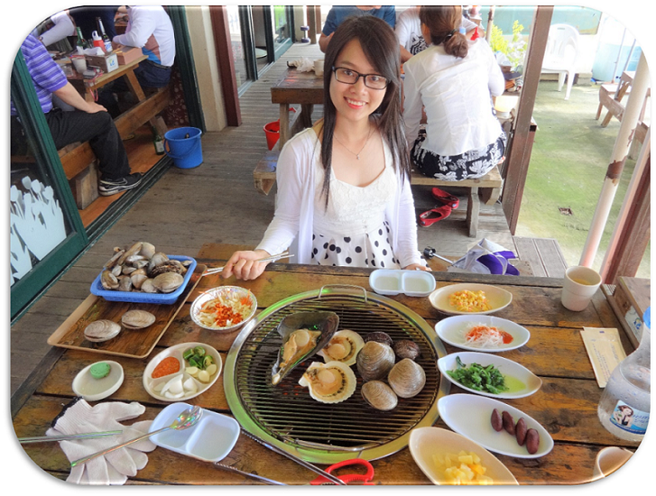
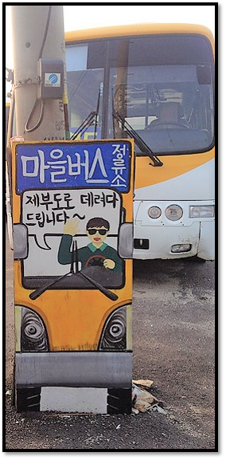

In Korea, there are tidal islands that you can reach by car or bus when the tides are low. Such islands are also called **the miracle of Moses** in Korea (perhaps they are inspired by the story of Moses splitting the seawater so that the Jewish delegation can cross the sea), and Jebu Island (Jebudo - 제부도) is one of them.

 A 2.3 km stretch of water between Jebu Island and the mainland is separated twice every day during the low tide, so the road for car and bus to get there appears. This road is remained for about 6 hours until it's submerged by the tide. 

Before going to Jebu Island, you need to check the <a href="http://www.myjebudo.com/calender/calender/calender.php?year=2018&month=1#" target="_blank">tide time schedule</a> so that you can arrange your trip because the time frame changes day by day.

##  What to do in Jebudo? 

Now, when you get there, you can spend time to exploring this place. Of course, sightseeing, going around and taking photos is the main activities. Additionally, there are also a few of activities that you can try:

<figure>
  
  <figcaption></figcaption>
</figure>

  * First thing is the mudflat appeared during the low tide. If you are a fan of Family outing or Running man (2 TV shows in Korea) just like me, you can enjoy playing on the mudflat like what people did on the shows. It’s interesting but quite dirty so you might need to change clothes after that. 

  * This is a good place to have a family picnic along the coast. Some families also visit this place in the weekend and rent pension, like a short holiday. Its low tide phenomenon allows kids view wildlife safely with their parents.

  * The red lighthouse in Jebu Island is normal but the way leads to it is full of flying seagulls. They are fearless and friendly so you can feed them snack and take nice pictures. 

<figure>
  
  <figcaption></figcaption>
</figure>

  * My most favorite thing there is riding the exciting Banana Boat. The captain will tow you a short ride along the coast and control the speed while you hang on and try not to fall off the boat. Don't worry, it's safe though a little bit risky, you will be wearing a life jacket. This ride cost around 15,000 – 20,000 krw/person.

##  What to eat 

I have lunch at Jebu island. The seafood is very good, there is some grilled seashells dish (조개 구이), noodles (국수) and rice with raw fish (회덮밥). I called a grilled seashells dish (조개 구이), this dish is about 20,000 krw/person.

<figure>
  
  <figcaption></figcaption>
</figure>

##  How to get there 

It is quite relatively easy to get there by bus. There are two subway stops from that you can take a bus to Jebudo. 

From Suwon Station (수원역), take Exit #4, get on Bus 1004.

From Geumjeong Station (금정역), take Exit #4, get on Bus 330.

 Both of the buses will lead to the west coast and stop at a bus stop called the Entrance of Jebudo (제부도 입구), this stop is in front of a convenience store. When you get off the bus, head to the right side of this convenience store. And in a parking lot behind the store is the bus stop for the local Jebudo Bus. You can easily find the yellow bus with the yellow signboard.