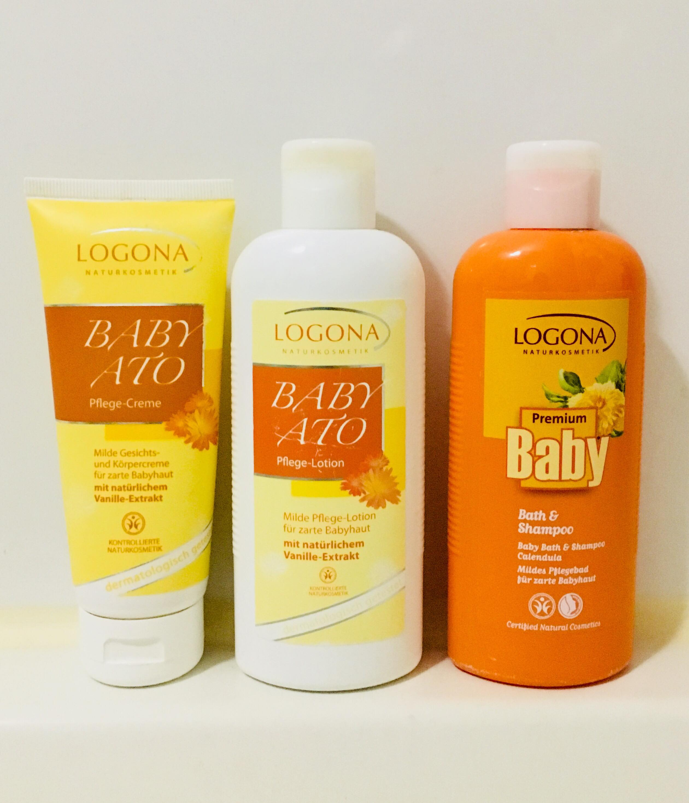

In the last post, I have introduced you my <a href="http://aquabubu.com/blog/baby/Pregnancy-checklist-Part-1/" target="_blank">pregnacy checklist for mom</a>, And now is what you need to prepare for your beloved baby.

###  Baby lotion + Baby bath and shampoo + Baby cream 

My baby was born in March and it was still winter in Korea. So I need both the lotion and face cream, the baby skin will be dry if I don't use it. It depends on the weather of each country that you should decide whether buy them or not. 

There are lots of baby brands such as Aveeno, Green Finger, Ato, Double Heart and the mothers should buy products from reliable brands, select the safety one for your baby and ecently, I don't trust Johnson&Johnson. I think you should buy a baby bath and shampoo 2-in-1, it will be very convenient.

<figure style="width: 300px" class="align-center">
  
  <figcaption></figcaption>
</figure>

As for me, my friend introduced me the baby products from the brand called **Logona**. He said it's very safe for the newborns. The bath and shampoo product smells slightly like yogurt, while baby lotion and cream smell like formula milk. This is a reliable German company but quite expensive so I use them when my baby is still small. When he grows up, I will switch to Goongbe (a Korean's baby brand).

###  Antiseptic cream 

 Because my baby wears diaper 24/7, so after peeing or pooping, I apply this cream on his areas such as buttocks and inguinal area. I use Sudocrem (made in USA) and have to say that it's really effective. I have been using it for nearly a year and it still lasts until now.

###  Umbilical sterilization 

 The doctor will suggest buying this after you give birth so don't worry. I bought one at a Korean drugstore.

###  Baby dental wipes 

<figure style="width: 200px" class="align-center">
  
  <figcaption></figcaption>
</figure>

I feed my baby both breastmilk and formula milk, so every day I use the dental wipes, once per day for baby and twice per day when starting solid feeding. I bought the dental wipes from BnB, it can be used for baby from birth to 2 years old baby.

###  Diaper 

Choosing the type and brand of diaper is also a problem causing headache: cloth diapers, band-type diapers, panty-type diapers. I will introduce the diapers my baby have been using: Huggies (0-1 months), Clean Bebe and Pampers (1-3 months), GooN (over 3 months), Huggies at night (over 6 months).

<figure style="width: 550px" class="align-center">
  
  <figcaption></figcaption>
</figure>

###  Baby wet tissue 

Every time he pees or poops, I always use baby wet tissues to clean him before putting on a new diaper. I find it very handy. But if the mother likes to use the cotton ball to clean the baby, it's still okay. Be sure you choose the safety wet tissue for your darling.

<figure style="width: 500px" class="align-center">
  
  <figcaption></figcaption>
</figure>

At first, I bought Pampers wet tissue. It's good but quite expensive and not always available in Korea so I changed to Soondoongi - good quality, cheap price and fast delivery. I like to use the odorless, embossing and larger sheet size.

###  Baby bath tub 

<figure style="width: 200px" class="align-center">
  
  <figcaption></figcaption>
</figure>

There are many types of baby bath tub, just choose one that you think it'll convenient and helpful.

###  Baby nail clipper set 

<figure style="width: 350px" class="align-center">
  
  <figcaption></figcaption>
</figure>

Baby fingernail and toenails are growing so fast that we need to cut it frequently to avoid the baby scratch himself/herself. Do not bite your baby nails because it's not hygienic that can cause infection easily.

###  Baby swimming neck ring 

 After the baby gets 3 months, swimming early will improve his balance, trigger two important swimming reflections: holding breath and movement. 

In the first time swimming, I hug my baby and got in the bathtub together. You should never let your baby swim alone, always pay attention and stand next to your baby. 

When your baby is still small, give him/her 5-7 minutes to swim, avoid swimming for a long time or he/she will get cold, and remember to warm the baby after that.

###  Baby bath toy 

<figure style="width: 300px" class="align-center">
  
  <figcaption></figcaption>
</figure>

Buy a few toys to drop in the tub when taking bath, your baby's gonna love it. I bought a set of these sea creatures and, expecting to buy some more that I can play with my baby.:laughing: Well, you don't need to buy the toy too soon, just buy them when your baby is ready for taking a swim in the tub.

###  Baby bed and mobile set 

<figure style="width: 300px" class="align-center">
  
  <figcaption style="font: arial" align="center"> Baby bed </figcaption>
</figure>

When my baby was in his first month, I usually put him on the bed with a mobile set, according to **raising baby following Japanese style**, the mobile set will help to increase the focus ability of the baby. When he was young, he mainly looked at black and white color, when getting bigger, he prefers to colorful things. 

<figure style="width: 300px" class="align-center">
  
  <figcaption style="font: arial" align="center"> Mobile set </figcaption>
</figure>

###  Baby stroller  

 After my baby is a months-old, we usually take him to the park in the weekend. A stroller is really helpful but you should buy a stroller that can be bent so the baby can either lie or sit on it.

###  Hipseat 

 I also buy a hipseat because it is said that the baby feels not only closer to the mother but also safer. Whenever I go somewhere near, I use the hipseat instead of the stroller. I recommend to use the hipseat only when your baby are able to seat. Before that, his/her spine was weak and if you use hipseat too early, it might cause the baby unwanted injuries.

## Baby clothes

###  Clothes 

<figure style="width: 550px" class="align-center">
  
  <figcaption></figcaption>
</figure>

I bought baby clothes as my friends' suggestion. In the first 2 months, I used to wrap my baby with towel. I bought 3 sizes for newborn and each size about 10 sets. You should ask the seller or other people for advice. 

###  Socks, gloves and hat 

I think 7-9 socks or gloves are enough, and it would be very convenient if they have same color.:smile:

<figure style="width: 300px" class="align-center">
  
  <figcaption></figcaption>
</figure>

Since the weather was cold, I bought 2-3 hats to cover my baby's fontanel. You can buy bigger size later when the baby's head bigger.

###  Towels 

<figure style="width: 350px" class="align-center">
  
  <figcaption></figcaption>
</figure>

You should buy many soft towels. Small size is for face cleaning, big size is for bathing.

###  Baby pillow 

 I bought 2-3 pillow concaves.But when the baby is still small, you should hold him as much as you can so that his head shape will be ok.

###  Baby bib 

Just buy the bib when the starting the solid feeding. There plastic bibs are preferable. After the meal, all you need to do is just wash and let it dry, fast and convenient.

<figure style="width: 350px" class="align-center">
  
  <figcaption></figcaption>
</figure>