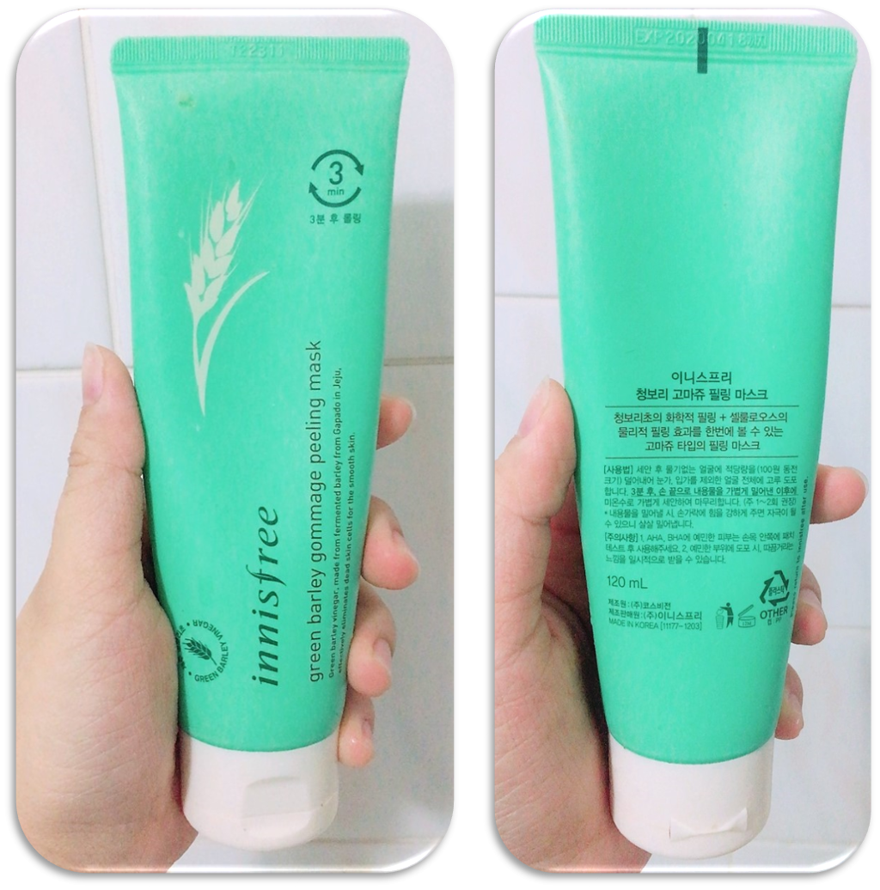
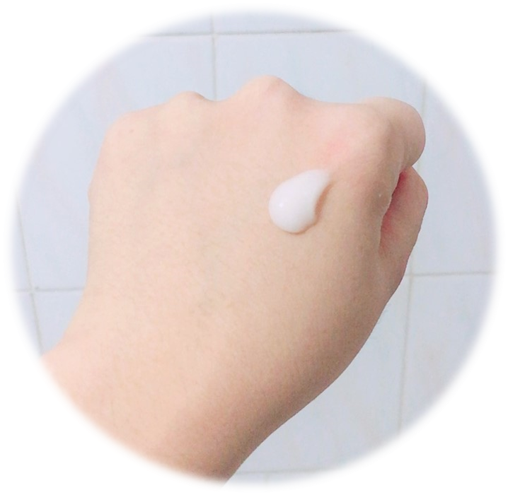
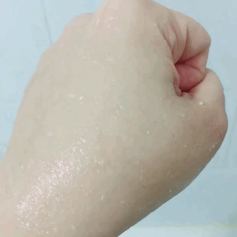

In my previous post, I have introduced <a href="http://aquabubu.com/en/Review-IOPE-Moisture-Skin-Soft-Peeling-Gel/" target="_blank">IOPE Moisture Skin Soft Peeling Gel</a>. But I always want to try the new thing so I switch to Innisfree Green Barley Gommage Peeling Mask. Comparing to IOPE peeling gel, this one is really cheap with only 14,000krw (~$14). After using it for a long time, today I’m gonna review this exfoliate product.

<figure style="width: 200px" class="align-center">
  
  <figcaption></figcaption>
</figure>

## Package & Texture
This peeling mask has a simple package just like other products of Innisfree. It’s a mint green color plastic tube with a cream white flip top cap, containing turbid grainy white gel with a barley scent I think. For me, the scent is ok, but maybe to some, it’s quite uncomfortable. But don’t worry, it will not last long.

<figure style="width: 200px" class="align-center">
  
  <figcaption></figcaption>
</figure>

## Innisfree claims that
Green barley vinegar, made from fermented barley from Gapado in Jeju, effectively eliminates dead skin cells for the smooth skin. A gommage-type peeling mask that combines the chemical peel of green barley vinegar and the physical peel of cellulose.

## Ingredients

 Water, Glycerin, Butylene Glycol, Cyclopentasiloxane, Squalane, Ammonium Acryloyldimethyltaurate/Vp Copolymer, Cyclohexasiloxane, Sodium Lactate, Glycolic Acid, Lactobionic Acid, Salicylic Acid, Saccharomyces/Barley Seed Ferment Filtrate, Orchid Extract, Camellia Sinensis Leaf Extract, Camellia Japonica Leaf Extract, Citrus Unshiu Peel Extract, Opuntia Coccinellifera Fruit Extract, Beta-Glucan, Hordeum Vulgare Seed Extract, Oryza Sativa (Rice) Extract, Glyceryl Stearate, Ceteth-20, Cetyl Alcohol, Steareth-20, Ethylhexylglycerin, Xanthan Gum, Polysilicone-11, Propanediol, Peg-240/Hdi Copolymer Bis-Decyltetradeceth-20 Ether, Peg-75 Stearate, Hydroxypropyl Starch Phosphate, Disodium Edta, Phenoxyethanol, Fragrance 

## How to use

After cleansing, towel dry skin, get an appropriate amount of the mask and smooth evenly over the face, avoiding the eye and lip areas.
After 3 minutes, gently rub and massage face using your fingertips with light circular motion.
Rinse off with lukewarm water.

## How it works

<figure style="width: 700px" class="align-center">
  
  <figcaption></figcaption>
</figure>

## I say

When the mask is spread out, it's sloppy and grainy and after a while, due to the cellulose, it starts to clump. After 3 min, the cellulose will exfoliate your dead skin cells and dirt by circulation massaging on face. I really like the way it works. The dead skin cells will be removed by massage and I can feel it – the reason why I prefer the peeling-type to scrub-type. 
This barley peeling mask makes my skin brighter and smoother after using without any irritation or dryness. It’s so gentle that my skin’s still moisturized and soft. I only use it twice per week and until now, I am still happy with it. What a lovely product!
Comparing to its price, Innisfree Green Barley Gommage Peeling Mask works effectively so I highly recommend it. If you’re looking for an affordable, effective and trusted exfoliation, why don’t you give it a try?

