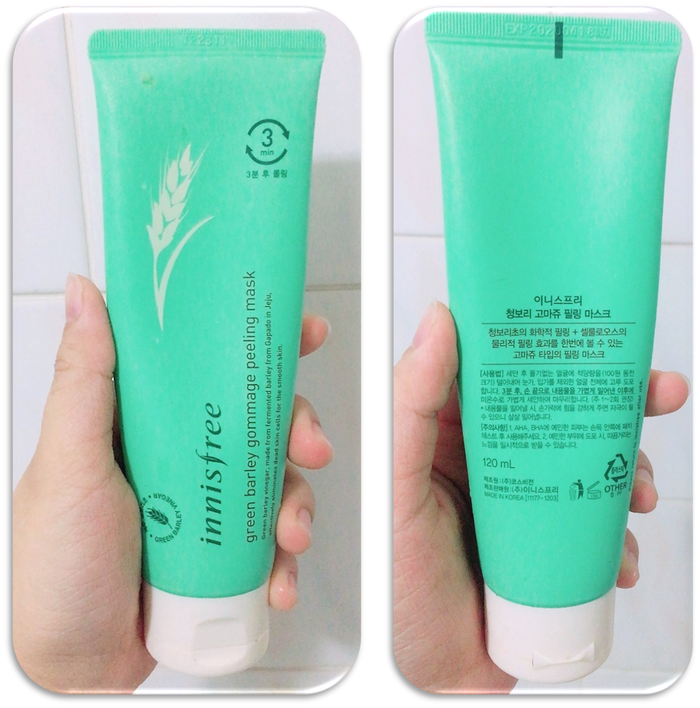
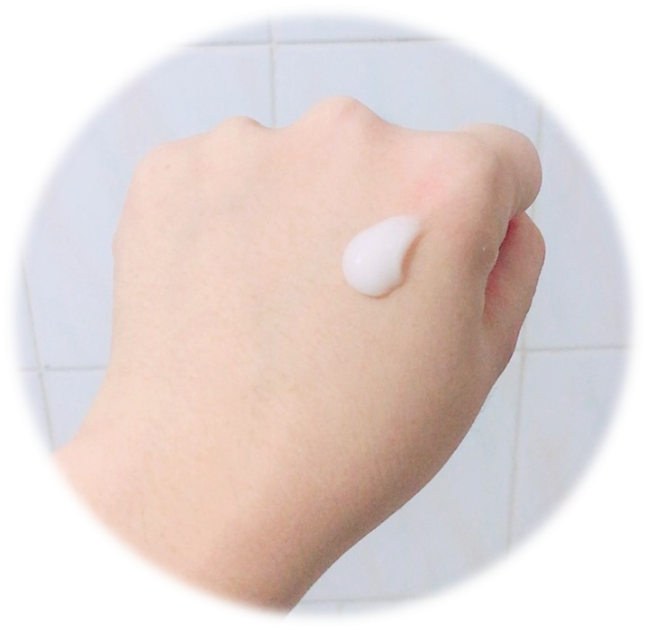
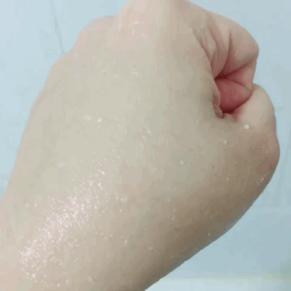

Trong bài viết trước , mình đã giới thiệu <a href="http://aquabubu.com/vi/Review-IOPE-Moisture-Skin-Soft-Peeling-Gel/" target="_blank">IOPE Moisture Skin Soft Peeling Gel</a>. Nhưng mình thì cứ thích thử nhiều loại khác nhau nên là xài xong em IOPE thì chuyển qua em Innisfree Green Barley Gommage Peeling Mask. So với em IOPE thì em này giá rất là "hạt dẻ" với chỉ 14.000krw. Sau khi sử dụng em nó một thời gian, hôm nay mình sẽ review nhé. ^^

<figure style="width: 200px" class="align-center">
  
  <figcaption></figcaption>
</figure>

## Bao bì và chất kem
Mặt nạ tẩy da chết này nhìn cũng đơn giản giống như các sản phẩm khác của Innisfree. Túyp nhựa màu xanh ngọc với nắp trắng, có chứa gel màu trắng đục và có mùi lúa mạch (mình nghĩ thế). Với mình thì mùi này không sao hết, nhưng một số bạn có thể thấy nó khá khó chịu đấy. Nhưng đừng lo, nó sẽ không kéo dài lâu đâu.

<figure style="width: 200px" class="align-center">
  
  <figcaption></figcaption>
</figure>

## Innisfree nói rằng
Giấm làm từ lúa mạch lên men ở Gapado - Jeju, có hiệu quả loại bỏ các tế bào da chết cho làn da mịn màng. Một loại mặt nạ tẩy tế bào chết kết hợp giữa tẩy da hóa học của giấm lúa mạch và tẩy da vật lý của cellulose.

## Thành phần

 Water, Glycerin, Butylene Glycol, Cyclopentasiloxane, Squalane, Ammonium Acryloyldimethyltaurate/Vp Copolymer, Cyclohexasiloxane, Sodium Lactate, Glycolic Acid, Lactobionic Acid, Salicylic Acid, Saccharomyces/Barley Seed Ferment Filtrate, Orchid Extract, Camellia Sinensis Leaf Extract, Camellia Japonica Leaf Extract, Citrus Unshiu Peel Extract, Opuntia Coccinellifera Fruit Extract, Beta-Glucan, Hordeum Vulgare Seed Extract, Oryza Sativa (Rice) Extract, Glyceryl Stearate, Ceteth-20, Cetyl Alcohol, Steareth-20, Ethylhexylglycerin, Xanthan Gum, Polysilicone-11, Propanediol, Peg-240/Hdi Copolymer Bis-Decyltetradeceth-20 Ether, Peg-75 Stearate, Hydroxypropyl Starch Phosphate, Disodium Edta, Phenoxyethanol, Fragrance 

## Cách sử dụng

Sau khi rửa mặt sạch, lau khô bằng khăn rồi lấy một lượng vừa đủ thoa đều lên mặt, tránh vùng mắt và môi.
Sau 3 phút, mát xa nhẹ nhàng theo chuyển động tròn để lấy đi các tế bào da chết và bụi bẩn trên mặt.
Rửa mặt bằng nước ấm.

## Khi mình dùng nè

<figure style="width: 700px" class="align-center">
  
  <figcaption></figcaption>
</figure>

## Cảm nhận của mình

Bôi mặt nạ lên mặt khá dễ dàng và có cảm giác có hạt lợn cợn và ngay sau đó, do mặt nạ có cellulose nên nó bắt đầu vón cục lại. Sau 3 phút, các "cục" cellulose này sẽ tẩy tế bào da chết và bụi bẩn khi mình mát xa mặt. Khi mát xa để tẩy da chết thì khá thú vị. Các tế bào da chết sẽ được loại bỏ mà mình có thể cảm nhận được - đây cũng là lý do mình thích tẩy da loại peeling.

Sau khi tẩy da chết xong thì da mặt mình sáng và mượt hơn hẳn, cũng không có bất kỳ kích ứng hoặc thấy mặt bị khô tí nào. Em này tẩy da khá nhẹ nhàng và mặt mình vẫn ẩm và mềm mại. Mình dùng ẻm hai lần một tuần và cho đến bây giờ vẫn hài lòng với ẻm.

So với em IOPE thì em Innisfree Green Barley Gommage Peeling Mask khá hiệu quả mà giá lại rẻ hơn nhiều nên mình rất thích. Nếu bạn đang tìm một em tẩy da chết giá cả phải chăng, hiệu quả và đáng tin cậy, bạn có thể thử em này nhé!
