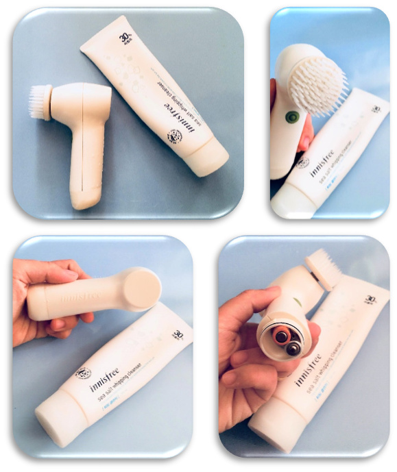
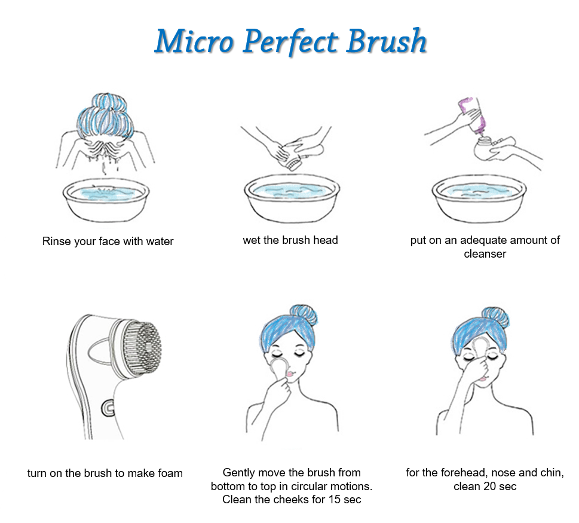
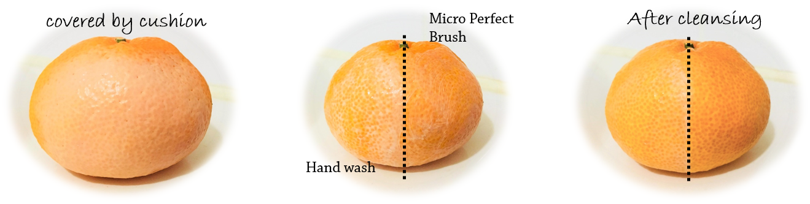
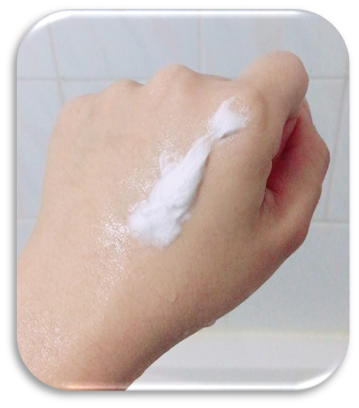
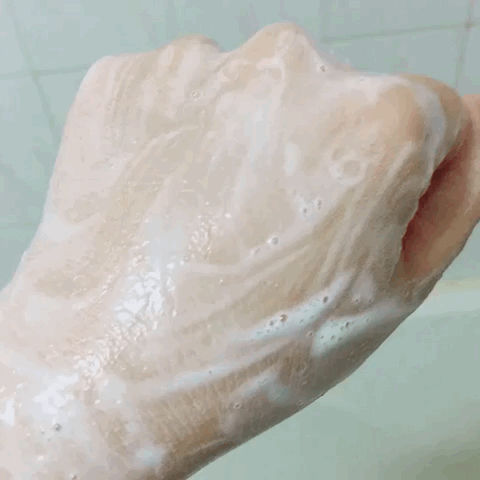

When watching some beauty channels I recognize that most of them always use the facial cleansing brushes and give many compliments about their deep cleaning effect. A clean face will enhance the effect of later moisturizing steps. Since I always want to look prettier, younger and keep my face clean, I decided to purchase Innisfree micro perfect cleanser. And in Innisfree store, I decided to buy both the brush and the Sea salt whipping cleanser (30% sea salt) with the discount of 30% so the price was only 26,600krw (~$25) for the brush and 7,000krw (~$6.58) for the cleanser. If you never heard of Innisfree, you can take a look at my <a href="http://aquabubu.com/en/innisfree" target="_blank">other posts</a>.^^

### Package and description

Innisfree always has very simple package for their products.

**The Micro perfect brush** is white, small enough for the portable and comes with an instruction to use. It has a changeable brush head and only one power button. In the bottom, there is a place to connect 2 AAA batteries. This brush is easy to use and change the brush head or the batteries. The special feature of this brush is a 0.003mm micro-fine brush, five times as thin as a strand of hair, perfectly cleanses the pores and other areas your hand can't reach. 

<figure style="width: 400px" class="align-center">
  
  <figcaption></figcaption>
</figure>

**The Sea salt whipping cleanser** is a simple white tube. It has a light scent and easy to make foam containing tiny particles for massage and peeling effect. It is said that this cleanser will rinse the skin with a rich, ocean salt-mixed froth that is as delicate as whipped cream. Delicate, rich froth completely scrubs the entire face, even parts that are regularly missed. The ocean salt concentrate expels soil and dead cells from skin. The rich mineral substance of Jeju salt acts to ensure the skin.

### How to use

<figure style="width: 400px" class="align-center">
  
  <figcaption></figcaption>
</figure>

For the Sea salt whipping cleanser, it is the same as other cleansers: wet your face first, put some amount to your palm and make foam before cleansing.

### How they work

I love these products, both the Micro perfect brush and the Sea salt whipping cleanser. 

<figure style="width: 400px" class="align-center">
  
  <figcaption></figcaption>
</figure>

The brush is easy to use, very handy and hygiene. In addition, the brush head is super soft that won’t hurt your sensitive skin. As you can see in the images above, the area that washed by the Micro perfect brush is totally cleaner than washed by hand. If you wash by hand, there is still a thin layer of cushion remains while by using the brush, they are completely removed. However, I recommend to use it about 2-3 times/week.

<figure style="width: 400px" class="align-center">
  
  <figcaption></figcaption>
</figure>

<figure style="width: 400px" class="align-center">
  
  <figcaption></figcaption>
</figure>

The Sea salt whipping cleanser is a good product for that price. Normally, if you use salt water to clean face, your face will be dry. This cleanser will not dry your skin. My skin is clean, smooth and still moisture after using it.  

Well, if you want to have an electric facial brush, why don’t you try the Micro perfect brush of Innisfree? It’s not that expensive but it has good cleaning effect and very gentle to your skin. You can also try the Sea salt whipping cleanser. Innisfree has 3 versions of the sea salt cleanser: 20% for dry skin, 30% for normal skin and 40% for oily skin. My skin is combination to dry so I use the 30%.

