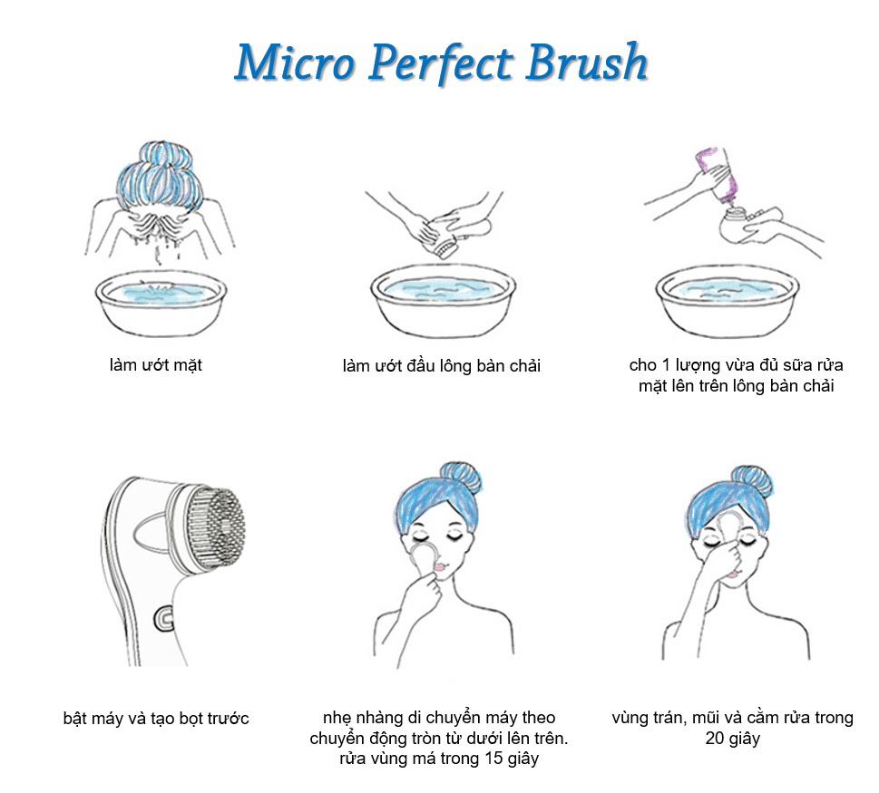
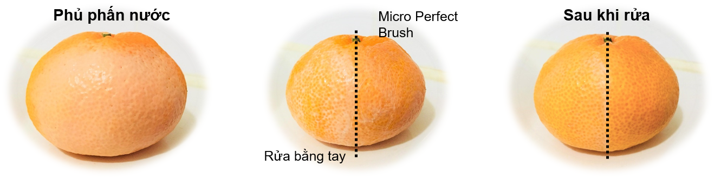

Khi xem một số kênh làm đẹp mình thấy là hầu hết các beauty blogger đều sử dụng máy rửa mặt và hết lời khen ngợi việc làm sạch sâu của mấy ẻm. Một khuôn mặt được rửa sạch sẽ tăng cường hiệu quả của các bước giữ ẩm sau đó. Vì mình luôn muốn nhìn đẹp hơn, trẻ hơn và rửa mặt sạch trước khi ngủ nên đã quyết định mua máy rửa mặt Innisfree Micro perfect brush. Và khi đến cửa hàng Innisfree thì số phận lại đẩy đưa mua cả máy rửa mặt và sữa rửa mặt Sea salt whipping cleanser (30% muối biển). Mình mua đợt sale 30% nên giá chỉ còn 26,600krw (~ $25) máy rửa mặt và 7,000krw (~$6.58) sữa rửa mặt. Nếu bạn chưa bao giờ nghe nói về Innisfree, bạn có thể xem thêm <a href="http://aquabubu.com/vi/innisfree" target="_blank">các bài viết khác</a> của mình nhé. ^^

### Bao bì và đôi nét về sản phẩm

Innisfree luôn có các mẫu bao bì rất đơn giản nhưng không kém phần bắt mắt.

**Máy rửa mặt** có màu trắng, nhỏ xinh vừa đủ để cầm tay và có kèm theo hướng dẫn sử dụng. Đầu lông bàn chải của máy thay được nhé và chỉ có một nút nguồn trên thân máy để bật/tắt. Dưới đáy là chỗ thay pin, máy dùng 2 cục pin AAA, hết pin mà thay thì cũng tiện lắm. Điểm nhấn của máy rửa mặt này là những sợi lông bàn chải siêu mỏng 0.003mm, dễ dàng làm sạch lỗ chân lông mà nếu chỉ dùng tay sẽ không sạch hết được.
 
<figure style="width: 400px" class="align-center">
  
  <figcaption></figcaption>
</figure>

**Sữa rửa mặt muối biển** đựng trong tuýp màu trắng in chữ đơn giản. Em này có mùi hương nhẹ và dễ tạo bọt với các hạt nhỏ li ti giúp mát xa và tẩy da chết. Người ta nói rằng em này sẽ rửa sạch mặt da bằng lớp bọt giàu muối giống như lớp kem bông tuyết ấy. Muối biển làm sạch và lấy đi các tế bào da chết. Chất khoáng trong muối biển từ Jeju giúp bảo vệ làn da.

### Cách sử dụng

<figure style="width: 400px" class="align-center">
  
  <figcaption></figcaption>
</figure>

Em sữa rửa mặt này xài giống như các loại khác: làm ướt mặt, cho lượng vừa đủ vào lòng bàn tay và tạo bọt rồi rửa mặt.

### Nhận xét

Mình thích cả hai em này luôn nhé: máy rửa mặt hay sữa rửa mặt đều tuyệt vời. 

<figure style="width: 400px" class="align-center">
  
  <figcaption></figcaption>
</figure>

**Máy rửa mặt** dễ sử dụng, tiện lợi và có thể vệ sinh dễ dàng. Ngoài ra, đầu lông bàn chải siêu mềm luôn nên sẽ không làm tổn thương ngay cả làn da nhạy cảm. Trong những hình ảnh trên mình test máy rửa mặt bằng quả quýt ấy các bạn. Nửa bên được rửa bằng máy rửa mặt thì sạch hơn hẳn khi rửa bằng tay: Nếu bạn rửa bằng tay, vẫn còn một lớp mỏng phấn nước còn dính lại trong khi dùng máy thì được rửa sạch hoàn toàn. Tuy nhiên, mình nghĩ chỉ nên sử dụng nó khoảng 2-3 lần/tuần thôi.

<figure style="width: 400px" class="align-center">
  
  <figcaption></figcaption>
</figure>

<figure style="width: 400px" class="align-center">
  
  <figcaption></figcaption>
</figure>

**Sữa rửa mặt muối biển** này hoàn toàn tốt với mức giá rất hợp lí nhé. Thông thường, nếu bạn sử dụng nước muối để rửa mặt thì sẽ bị khô da liền. Nhưng em này không hề làm khô da mình tí nào. Mặt của mình sạch, mịn màng và vẫn được giữ ẩm sau khi dùng nhé. Em này cũng có tác dụng diệt khuẩn ngăn ngừa mụn nữa.

Nếu bạn muốn mua máy rửa mặt với mức giá chấp nhận được thì có thể thử máy rửa mặt Micro perfect brush của Innisfree nhé. Em này không quá đắt tiền nhưng lại dễ sử dụng, thay pin và có hiệu quả làm sạch tốt và rất nhẹ nhàng với làn da của bạn. Bạn cũng có thể mua thử sữa rửa mặt muối biển nữa. Innisfree có 3 phiên bản sữa rửa mặt muối biển: 20% cho da khô, 30% cho da bình thường và 40% cho da nhờn. Da mình là hỗn hợp thiên khô vì vậy mình xài loại 30%.

