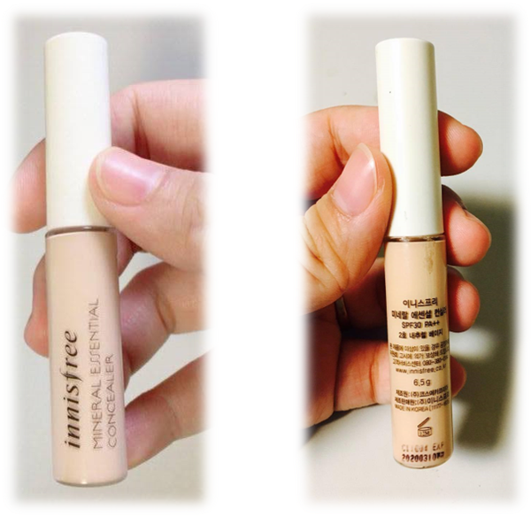
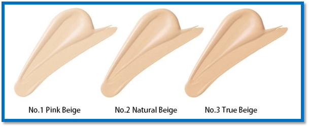
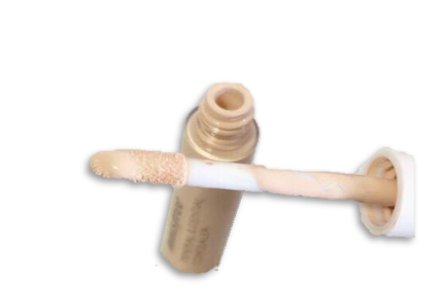
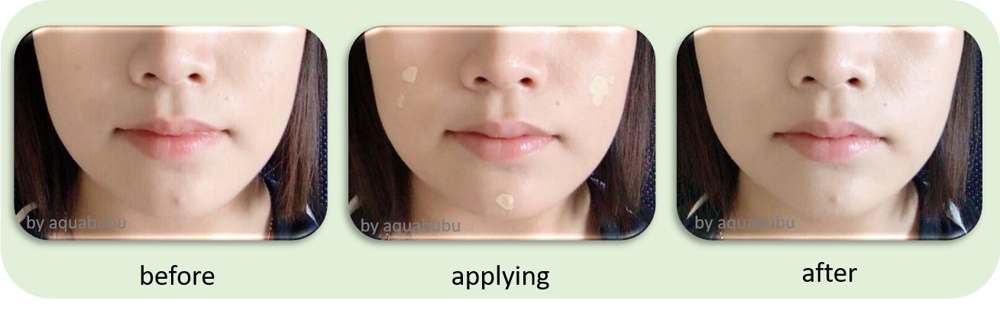

Có một làn da hoàn hảo là ước mơ của nhiều phụ nữ trong thế giới này, tất nhiên cũng bao gồm cả mình nữa! Tuy nhiên, gần đây bị rối loạn nội tiết tố hay sao mà mặt mình nổi rất nhiều mụn, và sau khi hết mụn thì vẫn còn cả một đống vết thâm trên mặt nữa. Thật là thiếu tự tin và hụt hẫng khi nhìn vào gương mà :sob: :sob: :sob:

Hồi xưa cứ tự tin là không cần trang điểm mà da vẫn đẹp, mà bây giờ phải nói là không trang điểm thì không dám ra đường ấy chứ. Thế là mình phải nghiên cứu để che cái đống mụn + vết thâm trên mặt, mua mỹ phẩm trang điểm là phải quan tâm đến độ che phủ, haizzzz. Sau khi tìm hiểu về các loại kem che khuyết điểm thì mình đã quyết định thử  **Innisfree Mineral Essential Concealer SPF30 PA++ 6.5g**, mình chọn Innisfree vì không chỉ có giá mềm mà chất lượng cũng khá ổn.

<figure style="width: 500px" class="align-center">
  
  <figcaption></figcaption>
</figure>

Mình toàn canh đợt giảm giá của hãng và liên hệ với người bạn hiện đang kinh doanh mỹ phẩm Hàn để mua, vừa có giá tốt mà vừa yên tâm về chất lượng nữa. Giá ở VN là 120k thì phải.

<figure style="width: 500px" class="align-center">
  
  <figcaption></figcaption>
</figure>

Kinh nghiệm của mình (và cũng như của hầu hết các chị em phụ nữa) về việc mua kem che khuyết điểm là bạn nên chọn một tông sáng hơn tông da của bạn. Mình đã chọn tông #2 – **Natural Beige**.

## Bao bì
Không thể đơn giản hơn, không hề có hộp mà chỉ là cái cai sản phẩm với miếng niêm phong nhỏ giữa nắp và thân chai, nhưng rất chắc chắn nhé. Trên thân chai toàn là tiếng Hàn.

## Thành phần
Mình chỉ thấy thành phần ghi tiếng Hàn thôi, chứ không tìm được tiếng Anh, nên mình bỏ qua google translate cho dịch, nhưng phải nói là mình khá yên tâm với hãng Innisfree.

 Cyclopentasiloxane, titanium dioxide, purified water, phenyltrimethicone, talc, butyleneglycol, cetylpiperazine/piperazine-10/1 dimethicone, 10-dimethicone, niacinamide, zinc oxide, dimethicone / vinyl dimethicone cross polymer, lauryl pyridine-9 polydimethylsiloxy ethyl cholate dimethicone, sodium chloride, mash extract, green tea extract, , Camellia leaf extract, tangerine peel extract, mineral salt, distearammonium hectorite, beeswax, triethoxycaprilylsilane, panthenol, hydroxyacetophenone, palmitic acid, stearic acid, Polyoxyethylene stearate, polyoxyethylene stearate, polyoxyethylene stearate, polyoxyethylene stearate, polyoxyethylene stearate, polyoxyethylene stearate, polyoxyethylene stearate, polyoxyethylene stearate, benzoate, disodium a-dithiane A, 1,2-hexanediol, red iron oxide, yellow iron oxide, black iron oxide, perfume 

**Innisfree giới thiệu rằng** kem che khuyết điểm này không chỉ có độ chống nắng cao, mà còn có tác dụng **chống nhăn, làm trắng, che phủ tốt và giữ ẩm cho da (đặc biệt là da khô)**.

## Cách dùng
Thật sự thì mình không biết trang điểm và cũng lười nên để đơn giản nhất thì sau các bước dưỡng da và kem chống nắng, mình chỉ dùng phấn nước và kem che khuyết điểm. Mình dùng tay hoặc miếng mút trang điểm để tán đều tren vùng cần che. Nếu bạn dùng che khuyết điểm trước rồi phấn nước sau thì trông tự nhiên hơn đấy.

**Dưỡng da -> Kem chống nắng -> Phấn nước -> Che khuyết điểm**
<figure style="width: 400px" class="align-center">
  
  <figcaption></figcaption>
</figure>

**Trước và sau khi xài nè**
<figure style="width: 700px" class="align-center">
  
  <figcaption></figcaption>
</figure>

**Kết luận của mình**

Mình thấy che khuyết điểm Innisfree này khá ổn với mức già mềm hơn hẳn so với các loại mỹ phẩm khác. Mình thường quét hai lớp, che vết thâm cho hiệu quả tốt hơn là che mấy vết mụn lồi lõm nhé (mình nghĩ sẽ tốt hơn nếu làm kĩ phần base makeup). Nhưng phải dưỡng da trước khi dùng nhé, nếu không chỗ quét che khuyết điểm sẽ bị khô và mốc. Mình không xài cho quầng thâm ở mắt, một phần do mình đeo kính, một phần do mình thấy khô, sợ nó đóng lại thì kinh.

Túm lại, bạn nào da mịn, chỉ muốn che vết thâm chứ không cần che mụn thì đây là sản phẩm đáng để thử nhé, giá mềm và tốt, nếu mua cần tìm được nguồn tin cậy mà mua.
